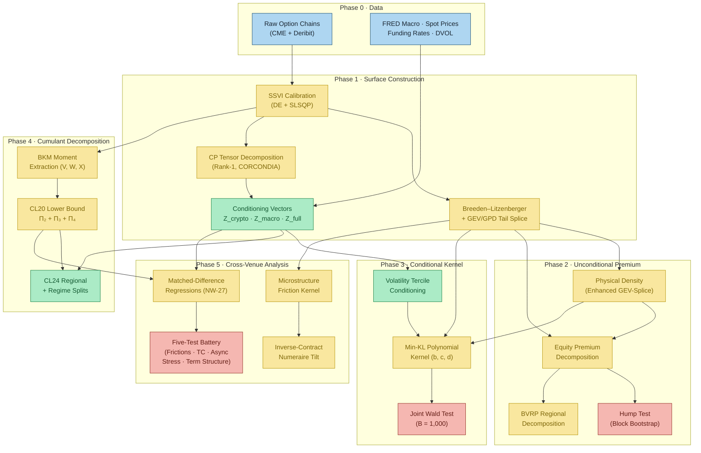

# Dissecting the Bitcoin Premium: Pricing Kernels and Microstructure Frictions across CME and Deribit

_MSc Thesis by Luca Leimbeck Del Duca | **Erasmus University Rotterdam** | Supervisor: Dr. Maria Grith_


## Abstract

This thesis investigates whether the hump-shaped Bitcoin pricing kernel and elevated kurtosis risk premium documented on the offshore Deribit exchange are fundamental properties of the digital asset class or artifacts of venue-specific microstructure. Using daily Bitcoin option chains from CME and Deribit over 772 matched trading days (January 2020–August 2023), a five-phase pipeline constructs arbitrage-free implied volatility surfaces, extracts risk-neutral densities via the Breeden–Litzenberger formula, compresses the cross-venue surface panel into a low-dimensional state vector, and estimates conditional pricing kernels, model-free expected return bounds, and cross-venue cumulant-premium regressions. The analysis establishes that pricing kernel non-monotonicity and the elevated kurtosis premium are asset-class features present on both venues, while the cross-venue premium wedge reflects genuine microstructure frictions that neither contract design nor any observable friction proxy can explain.

## Repository Architecture

The codebase is organized as a sequential five-phase pipeline. Core estimation modules live at the project root alongside phase-specific runner scripts.

```text
├── config.py / config.yaml         # Paths, sample window, filter thresholds, grid specs
├── main.py                         # Master pipeline runner with CLI (--from, --only, --skip)
│
├── ── Phase 0: Data ──
│   └── (config.yaml)               # Raw CME/Deribit paths, FRED API key, cleaning filters
│
├── ── Phase 1: Surface Construction ──
│   ├── ssvi.py                     # SSVI calibration (Differential Evolution + SLSQP)
│   ├── fit_surfaces.py             # Daily surface fitting across venues
│   ├── breeden_litzenberger.py     # BL density extraction with GEV/GPD tail splicing
│   ├── extract_densities.py        # Batch RND extraction at fixed τ = 27 days
│   ├── tensor_pca.py               # CP tensor decomposition (ALS, rank selection)
│   ├── run_tensor_pca.py           # Runner: rank sweep, CORCONDIA, mode visualization
│   └── build_conditioning_vectors.py  # Z_crypto, Z_macro, Z_full from CP factors + FRED
│
├── ── Phase 2: Unconditional Premium ──
│   ├── physical_density.py         # Enhanced GEV-splice physical density estimator
│   ├── ep_decomposition.py         # Beason–Schreindorfer EP curve + regional decomposition
│   ├── run_phase2.py               # Runner: EP, densities overlay, CEP
│   ├── run_hump_test.py            # Block-bootstrap monotonicity test (H statistic)
│   ├── run_bvrp_decomposition.py   # Regional BVRP under common physical density
│   ├── run_nb_sweep.py             # Bin-count sensitivity for physical density
│   ├── run_ep_diff_ci.py           # Paired bootstrap: enhanced vs vanilla EP difference
│   └── run_grid_sensitivity.py     # Return-grid truncation robustness
│
├── ── Phase 3: Conditional Kernel ──
│   ├── conditional_kernel.py       # Minimum-KL polynomial kernel (b, c, d) parameterization
│   ├── joint_regime_test.py        # Wald test: δ_low = δ_high across terciles
│   ├── bootstrap_inference.py      # Block-bootstrap engine (B = 1,000)
│   ├── run_phase3.py               # Runner: kernel estimation, tercile splits
│   ├── run_phase3_bootstrap.py     # Runner: bootstrap CIs for kernel coefficients
│   └── run_phase3_kde_robustness.py  # KDE-tilt robustness check
│
├── ── Phase 4: Cumulant Decomposition ──
│   ├── bkm_moments.py              # BKM (2003) variance, cubic, quartic contracts
│   ├── cumulant_premia.py          # CL20 lower bound: Π₂, Π₃, Π₄ contributions
│   ├── run_phase4.py               # Runner: moment extraction, CL20 table, θ-robustness
│   ├── run_cl24_regional.py        # CL24 regional decomposition (down/center/up)
│   └── run_regime_episodes.py      # Two-peak episode test with affine bootstrap CIs
│
├── ── Phase 5: Cross-Venue Analysis ──
│   ├── cross_venue.py              # MFK, matched-difference regressions, DK panel
│   ├── inverse_contract.py         # Change-of-numeraire decomposition (dQᴮ/dQ$ = R)
│   ├── run_phase5.py               # Runner: wedge regressions, regional MFK
│   ├── run_friction_regressions.py # Funding-rate and basis-spread regressions
│   ├── run_inverse_contract.py     # Runner: predicted vs measured Ψ(R)
│   ├── run_notrade_band.py         # Transaction-cost band cascade
│   ├── run_async_orthogonality.py  # Settlement-timing orthogonality test
│   ├── run_wedge_term_structure.py # Maturity term structure (τ = 14, 27, 60)
│   └── run_stress_events.py        # COVID / Terra / FTX event-window regressions
│
├── ── Notebooks (executed Markdown) ──
│   ├── 00_preprocessing.md         # Data cleaning, summary statistics
│   ├── 00_data_exploration.md      # Exploratory analysis
│   ├── 01_ssvi_rnd.md              # SSVI diagnostics, RND visualization
│   ├── 01_tensor_pca.md            # Tensor rank selection, mode factors
│   ├── 01_conditioning.md          # Conditioning variable construction
│   ├── 02_ep_decomposition.md      # EP curves, density overlays, hump test
│   ├── 03_conditional_kernel.md    # Tercile kernels, regime episodes
│   ├── 04_moment_decomposition.md  # CL20/CL24 tables, κ-sensitivity, θ-sweep
│   └── 05_cross_venue.md           # MFK, inverse contract, friction battery
│
├── ── Outputs (git-ignored) ──
│   ├── data/cleaned/               # Cleaned parquets (CME, Deribit, auxiliary)
│   ├── data/phase{1..5}/           # Intermediate phase artifacts
│   ├── results/phase{1..5}/        # Tables (CSV) and figures (PNG)
│   └── results/pipeline_logs/      # Timestamped execution logs
│
└── terminal_output_final.log       # Full pipeline run log (reference)
```

## Methodology Flowchart



## Usage

```bash
# Full pipeline
python main.py

# Skip bootstrap for fast iteration
python main.py --skip-bootstrap --skip-diagnostics

# Resume from Phase 3 onward
python main.py --from 3

# Run only the cross-venue analysis
python main.py --only 5 5b 5c 5d 5e 5f 5g

# Custom bootstrap replicates and parallelism
python main.py --bootstrap-B 1000 --bootstrap-workers 6
```

## Dependencies

Core scientific stack: `numpy`, `scipy`, `pandas`, `tensorly`, `statsmodels`, `matplotlib`, `seaborn`. Data retrieval: `yfinance`, `fredapi`, `aiohttp` (Deribit API). All standard `pip install` — no GPU required.

## Citation

```bibtex
@mastersthesis{leimbeckdelduca2026bitcoin,
  author  = {Leimbeck Del Duca, Luca},
  title   = {Dissecting the {Bitcoin} Premium: Pricing Kernels and
             Microstructure Frictions across {CME} and {Deribit}},
  school  = {Erasmus University Rotterdam},
  year    = {2026},
  type    = {MSc Thesis},
  note    = {Supervisor: Dr.\ Maria Grith}
}
```