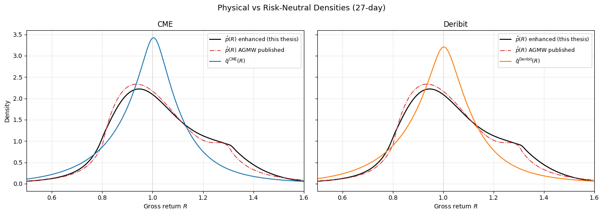
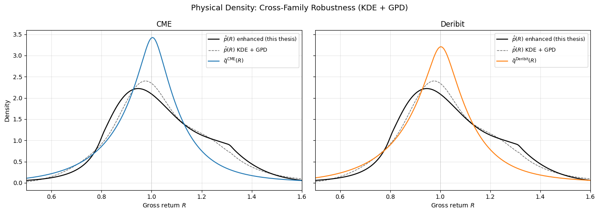
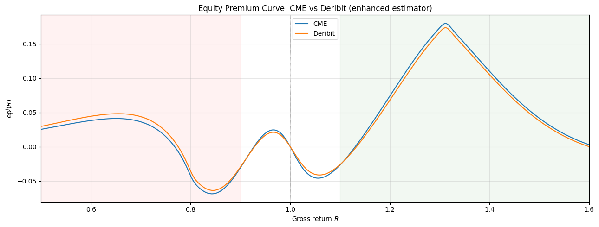
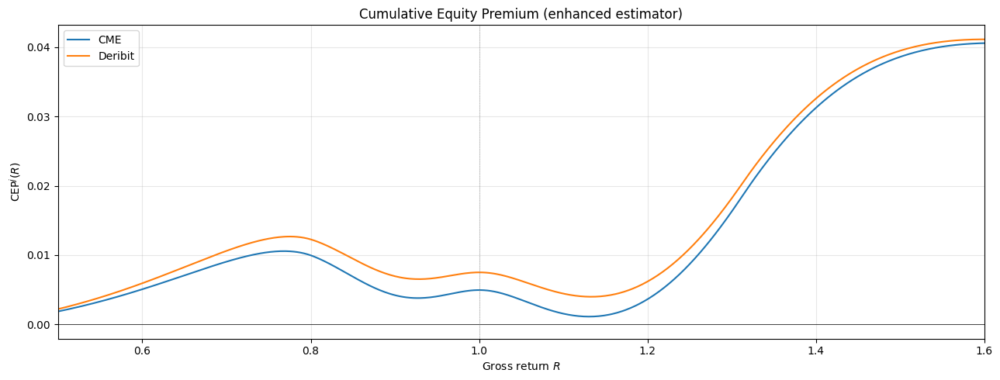
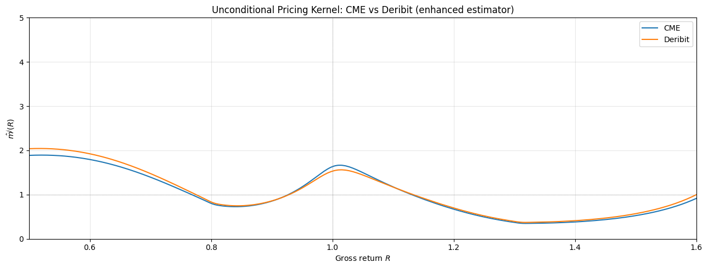
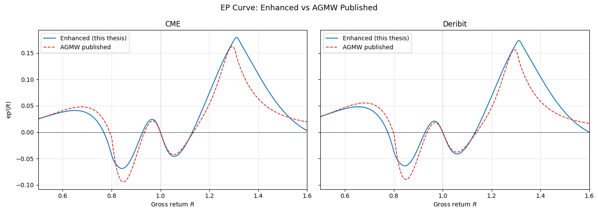
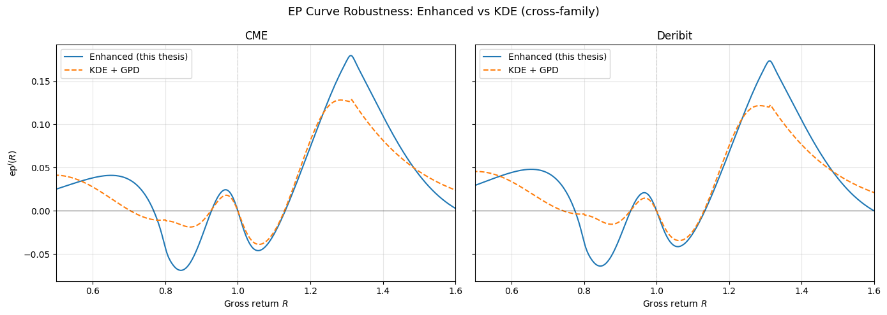
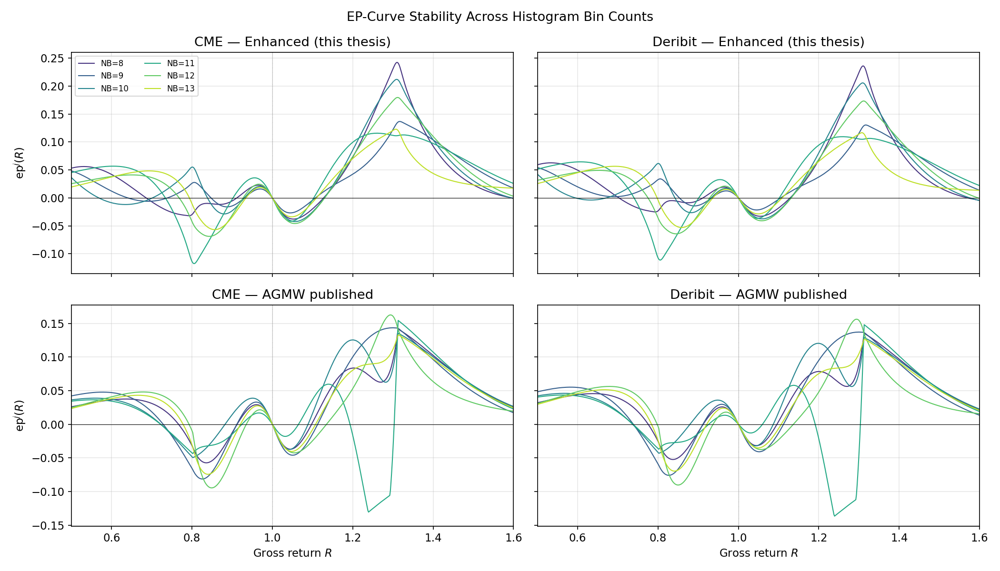
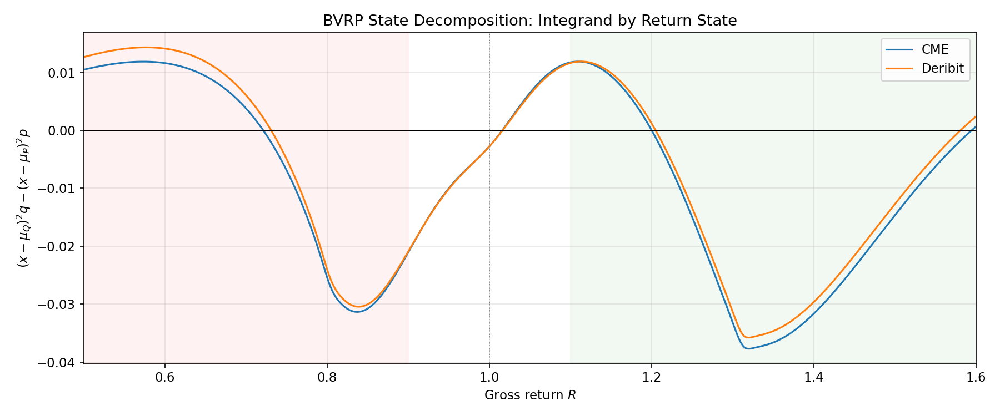
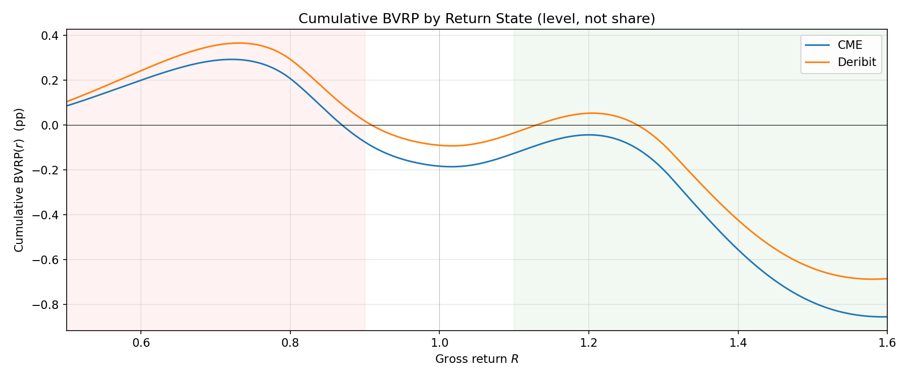

```python
import pandas as pd
import numpy as np
import matplotlib.pyplot as plt
from pathlib import Path
import sys

project_root = Path.cwd().parent
if str(project_root) not in sys.path:
    sys.path.append(str(project_root))
```


```python
from src.config import get_path, get_sample_window

plt.rcParams['figure.figsize'] = (12, 5)
plt.rcParams['axes.grid'] = True
plt.rcParams['grid.alpha'] = 0.3

DATA_P2 = get_path('data_phase2')
RES_P2 = get_path('results_phase2')
FIG_DIR = RES_P2 / 'figures'
TAB_DIR = RES_P2 / 'tables'
FIG_DIR.mkdir(parents=True, exist_ok=True)
TAB_DIR.mkdir(parents=True, exist_ok=True)

d = np.load(DATA_P2 / 'phase2_densities.npz')
R = d['R_grid']
R_PLOT = np.arange(R[0], R[-1] + 0.001, 0.01)
p_enh = d['p_almeida']
p_van = d['p_vanilla']
p_kde = d['p_kde']
q_cme = d['q_cme']
q_der = d['q_der']

# Load summary (three estimators x two venues)
summary = pd.read_csv(TAB_DIR / 'ep_decomposition_summary.csv')
print("--- EP Decomposition Summary ---")
print(summary.to_string(index=False))

def show_table(path, cols=None, title=None, rounding=4, sort=None, produced_by=None):
    """Display a results CSV defensively."""
    from pathlib import Path
    path = Path(path)
    if not path.exists():
        msg = f"[not found] {path}"
        if produced_by:
            msg += f"\n              run {produced_by} to produce it"
        print(msg)
        return None
    df = pd.read_csv(path)
    if title:
        print(f"--- {title} ---")
    if sort:
        keep = [c for c in sort if c in df.columns]
        if keep:
            df = df.sort_values(keep)
    if cols:
        avail = [c for c in cols if c in df.columns]
        missing = [c for c in cols if c not in df.columns]
        if missing:
            print(f"[note] columns absent from file: {missing}")
        if avail:
            df_show = df[avail]
        else:
            print("[note] none of the requested columns present — showing all")
            df_show = df
    else:
        df_show = df
    print(df_show.round(rounding).to_string(index=False))
    print(f"\n[{len(df)} rows]  source: {path.name}")
    return df
```

    --- EP Decomposition Summary ---
    venue estimator  total_ep  downside_contrib  downside_share  mid_contrib  mid_share  upside_contrib  upside_share
      CME   almeida  0.036274          0.004230        0.116611    -0.002666  -0.073501        0.034710      0.956890
      DER   almeida  0.036142          0.006968        0.192791    -0.002509  -0.069426        0.031683      0.876635
      CME   vanilla  0.036717          0.005334        0.145274    -0.003051  -0.083104        0.034434      0.937829
      DER   vanilla  0.036585          0.008072        0.220636    -0.002894  -0.079113        0.031407      0.858477
      CME       kde  0.041627          0.006614        0.158877    -0.002207  -0.053014        0.037220      0.894137
      DER       kde  0.041494          0.009351        0.225366    -0.002050  -0.049400        0.034193      0.824035
    

#### 1. Physical vs Risk-Neutral Densities


```python
fig, axes = plt.subplots(1, 2, figsize=(14, 5), sharey=True)
for ax, (venue, q, color) in zip(axes, [('CME', q_cme, 'C0'), ('Deribit', q_der, 'C1')]):
    ax.plot(R_PLOT, np.interp(R_PLOT, R, p_enh), 'k-', lw=1.6, label=r'$\hat{p}(R)$ enhanced (this thesis)')
    ax.plot(R_PLOT, np.interp(R_PLOT, R, p_van), color='C3', ls='-.', lw=1.2, label=r'$\hat{p}(R)$ AGMW published')
    ax.plot(R_PLOT, np.interp(R_PLOT, R, q), color=color, lw=1.5, label=rf'$\bar{{q}}^{{\mathrm{{{venue}}}}}(R)$')
    ax.axvline(1.0, color='gray', lw=0.5, ls=':')
    ax.set_xlabel('Gross return $R$')
    ax.set_xlim(0.5, 1.6)
    ax.set_title(venue)
    ax.legend(fontsize=9)
axes[0].set_ylabel('Density')
fig.suptitle('Physical vs Risk-Neutral Densities (27-day)', fontsize=13)
plt.tight_layout()
plt.show()
```


    

    


```python
# #### 1b. Appendix — Cross-Family Robustness (KDE + GPD)

fig, axes = plt.subplots(1, 2, figsize=(14, 5), sharey=True)
for ax, (venue, q, color) in zip(axes, [('CME', q_cme, 'C0'), ('Deribit', q_der, 'C1')]):
    ax.plot(R_PLOT, np.interp(R_PLOT, R, p_enh), 'k-', lw=1.6, label=r'$\hat{p}(R)$ enhanced (this thesis)')
    ax.plot(R_PLOT, np.interp(R_PLOT, R, p_kde), 'k--', lw=1.0, alpha=0.6, label=r'$\hat{p}(R)$ KDE + GPD')
    ax.plot(R_PLOT, np.interp(R_PLOT, R, q), color=color, lw=1.5, label=rf'$\bar{{q}}^{{\mathrm{{{venue}}}}}(R)$')
    ax.axvline(1.0, color='gray', lw=0.5, ls=':')
    ax.set_xlabel('Gross return $R$')
    ax.set_xlim(0.5, 1.6)
    ax.set_title(venue)
    ax.legend(fontsize=9)
axes[0].set_ylabel('Density')
fig.suptitle('Physical Density: Cross-Family Robustness (KDE + GPD)', fontsize=13)
plt.tight_layout()
plt.show()

```


    

    


#### 2. EP Curve: CME vs Deribit


```python
ep_cme = (R - 1) * (p_enh - q_cme)
ep_der = (R - 1) * (p_enh - q_der)

fig, ax = plt.subplots(figsize=(13, 5))
ax.plot(R_PLOT, np.interp(R_PLOT, R, ep_cme), 'C0-', lw=1.5, label='CME')
ax.plot(R_PLOT, np.interp(R_PLOT, R, ep_der), 'C1-', lw=1.5, label='Deribit')
ax.axhline(0, color='black', lw=0.5)
ax.axvline(1.0, color='gray', lw=0.5, ls=':')
ax.axvspan(R[0], 0.90, alpha=0.05, color='red')
ax.axvspan(1.10, R[-1], alpha=0.05, color='green')
ax.set_xlabel('Gross return $R$')
ax.set_ylabel(r'$\mathrm{ep}^j(R)$')
ax.set_xlim(0.5, 1.6)
ax.set_title('Equity Premium Curve: CME vs Deribit (enhanced estimator)')
ax.legend()
plt.tight_layout()
plt.show()
```


    

    


#### 3. Cumulative EP


```python
from scipy.integrate import cumulative_trapezoid

cep_cme = cumulative_trapezoid(ep_cme, R, initial=0.0)
cep_der = cumulative_trapezoid(ep_der, R, initial=0.0)

fig, ax = plt.subplots(figsize=(13, 5))
ax.plot(R_PLOT, np.interp(R_PLOT, R, cep_cme), 'C0-', lw=1.5, label='CME')
ax.plot(R_PLOT, np.interp(R_PLOT, R, cep_der), 'C1-', lw=1.5, label='Deribit')
ax.axhline(0, color='black', lw=0.5)
ax.axvline(1.0, color='gray', lw=0.5, ls=':')
ax.set_xlabel('Gross return $R$')
ax.set_ylabel(r'$\mathrm{CEP}^j(R)$')
ax.set_xlim(0.5, 1.6)
ax.set_title('Cumulative Equity Premium (enhanced estimator)')
ax.legend()
plt.tight_layout()
plt.show()
```


    

    


#### 4. Unconditional Pricing Kernel

Under standard risk aversion this should be monotonically decreasing. A hump (local increase) in the small-negative-return region
is the anomaly documented by Almeida et al. (2026) on Deribit.


```python
p_safe = np.maximum(p_enh, 1e-15)
k_cme = q_cme / p_safe
k_der = q_der / p_safe
k_cme[p_enh < 1e-15] = np.nan
k_der[p_enh < 1e-15] = np.nan

fig, ax = plt.subplots(figsize=(13, 5))
m_c, m_d = np.isfinite(k_cme), np.isfinite(k_der)
ax.plot(R_PLOT, np.interp(R_PLOT, R[m_c], k_cme[m_c]), 'C0-', lw=1.5, label='CME')
ax.plot(R_PLOT, np.interp(R_PLOT, R[m_d], k_der[m_d]), 'C1-', lw=1.5, label='Deribit')
ax.axhline(1.0, color='gray', lw=0.5, ls=':')
ax.axvline(1.0, color='gray', lw=0.5, ls=':')
ax.set_xlabel('Gross return $R$')
ax.set_ylabel(r'$\hat{m}^j(R)$')
ax.set_xlim(0.5, 1.6)
ax.set_ylim(0, 5)
ax.set_title('Unconditional Pricing Kernel: CME vs Deribit (enhanced estimator)')
ax.legend()
plt.tight_layout()
plt.show()
```


    

    


#### 5. Regional Decomposition Summary

Decompose total EP into downside ($R < 0.90$), mid ($0.90 \leq R \leq 1.10$), and
upside ($R > 1.10$) contributions.


```python
summary_pp = summary.copy()
for col in ['downside_contrib', 'mid_contrib', 'upside_contrib']:
    summary_pp[col + '_pp'] = summary_pp[col] * 100

pivot_contrib = summary_pp.pivot(
    index='venue', columns='estimator',
    values=['total_ep', 'downside_contrib_pp', 'mid_contrib_pp', 'upside_contrib_pp'])
print("--- Regional contributions (percentage points), reportable ---")
print(pivot_contrib.round(3).to_string())

print("\n--- Regional shares (unstable near-zero denominator; context only) ---")
pivot_share = summary.pivot(
    index='venue', columns='estimator',
    values=['downside_share', 'mid_share', 'upside_share'])
print(pivot_share.round(2).to_string())
```

    --- Regional contributions (percentage points), reportable ---
              total_ep                downside_contrib_pp                mid_contrib_pp                upside_contrib_pp               
    estimator  almeida    kde vanilla             almeida    kde vanilla        almeida    kde vanilla           almeida    kde vanilla
    venue                                                                                                                              
    CME          0.036  0.042   0.037               0.423  0.661   0.533         -0.267 -0.221  -0.305             3.471  3.722   3.443
    DER          0.036  0.041   0.037               0.697  0.935   0.807         -0.251 -0.205  -0.289             3.168  3.419   3.141
    
    --- Regional shares (unstable near-zero denominator; context only) ---
              downside_share               mid_share               upside_share              
    estimator        almeida   kde vanilla   almeida   kde vanilla      almeida   kde vanilla
    venue                                                                                    
    CME                 0.12  0.16    0.15     -0.07 -0.05   -0.08         0.96  0.89    0.94
    DER                 0.19  0.23    0.22     -0.07 -0.05   -0.08         0.88  0.82    0.86
    

#### 6. Estimator Robustness: Almeida vs KDE


```python
ep_cme_van = (R - 1) * (p_van - q_cme)
ep_der_van = (R - 1) * (p_van - q_der)

fig, axes = plt.subplots(1, 2, figsize=(14, 5), sharey=True)
for ax, (venue, ep_e, ep_v) in zip(axes,
        [('CME', ep_cme, ep_cme_van), ('Deribit', ep_der, ep_der_van)]):
    ax.plot(R_PLOT, np.interp(R_PLOT, R, ep_e), 'C0-', lw=1.5, label='Enhanced (this thesis)')
    ax.plot(R_PLOT, np.interp(R_PLOT, R, ep_v), 'C3--', lw=1.3, label='AGMW published')
    ax.axhline(0, color='black', lw=0.5)
    ax.axvline(1.0, color='gray', lw=0.5, ls=':')
    ax.set_xlabel('Gross return $R$')
    ax.set_xlim(0.5, 1.6)
    ax.set_title(venue)
    ax.legend()
axes[0].set_ylabel(r'$\mathrm{ep}^j(R)$')
fig.suptitle('EP Curve: Enhanced vs AGMW Published', fontsize=13)
plt.tight_layout()
plt.show()
```


    

    


```python
# 6b. Appendix — Estimator Robustness: Enhanced vs KDE

ep_cme_kde = (R - 1) * (p_kde - q_cme)
ep_der_kde = (R - 1) * (p_kde - q_der)

fig, axes = plt.subplots(1, 2, figsize=(14, 5), sharey=True)
for ax, (venue, ep_e, ep_k) in zip(axes,
        [('CME', ep_cme, ep_cme_kde),
         ('Deribit', ep_der, ep_der_kde)]):
    ax.plot(R_PLOT, np.interp(R_PLOT, R, ep_e), '-', lw=1.5, label='Enhanced (this thesis)')
    ax.plot(R_PLOT, np.interp(R_PLOT, R, ep_k), '--', lw=1.5, label='KDE + GPD')
    ax.axhline(0, color='black', lw=0.5)
    ax.axvline(1.0, color='gray', lw=0.5, ls=':')
    ax.set_xlabel('Gross return $R$')
    ax.set_xlim(0.5, 1.6)
    ax.set_title(venue)
    ax.legend()
axes[0].set_ylabel(r'$\mathrm{ep}^j(R)$')
fig.suptitle('EP Curve Robustness: Enhanced vs KDE (cross-family)', fontsize=13)
plt.tight_layout()
plt.show()
```


    

    


#### 7. Appendix — NB-Sweep Stability and Published-Bound Binding


```python
nb_summary_path = TAB_DIR / 'nb_sweep_summary.csv'
sigma_bind_path = TAB_DIR / 'sigma_binding_check.csv'
nb_fig_path = FIG_DIR / 'fig_nb_sweep_appendix.png'

if nb_summary_path.exists():
    nb_summary = pd.read_csv(nb_summary_path)
    print("--- NB-sweep stability (range as fraction of NB=12 peak) ---")
    print(nb_summary[['estimator', 'venue', 'density_range_pct',
                      'ep_range_pct', 'total_ep_spread']].round(4).to_string(index=False))
else:
    print(f"[not found] {nb_summary_path} — run run_nb_sweep.py first")

if sigma_bind_path.exists():
    bind = pd.read_csv(sigma_bind_path)
    print("\n--- Published-bound binding (vanilla), by NB ---")
    print(bind[['n_bins', 'van_sigma_L', 'van_sigma_R', 'van_any_bound_binds',
               'van_binding_detail', 'van_rank_deficient']].round(4).to_string(index=False))
    n_bind = int(bind['van_any_bound_binds'].sum())
    print(f"\nPublished bounds bind in {n_bind}/{len(bind)} bin-count settings.")
else:
    print(f"[not found] {sigma_bind_path} — run run_nb_sweep.py first")
```

    --- NB-sweep stability (range as fraction of NB=12 peak) ---
    estimator venue  density_range_pct  ep_range_pct  total_ep_spread
      almeida   CME             0.3976        0.9730           0.0066
      almeida   DER             0.3976        1.0084           0.0066
      vanilla   CME             0.4635        1.6523           0.0252
      vanilla   DER             0.4635        1.7195           0.0252
    
    --- Published-bound binding (vanilla), by NB ---
     n_bins  van_sigma_L  van_sigma_R  van_any_bound_binds  van_binding_detail  van_rank_deficient
          8       0.0526       0.1475                 True           k_R_lower                True
          9       0.0880       0.1389                 True k_L_lower,k_R_lower                True
         10       0.0985       0.1505                 True k_L_lower,k_R_lower                True
         11       0.1018       0.1411                 True k_L_lower,k_R_lower                True
         12       0.0291       0.0411                 True k_L_upper,k_R_upper                True
         13       0.0295       0.1496                 True k_R_lower,k_L_upper                True
    
    Published bounds bind in 6/6 bin-count settings.
    


```python
from IPython.display import Image, display

if nb_fig_path.exists():
    display(Image(filename=str(nb_fig_path)))
else:
    print(f"[not found] {nb_fig_path} — run run_nb_sweep.py first")
```


    

    


#### 8. Appendix - Grid Sensitivity of the Total EP

Integration-window dependence of the EP total, per estimator and venue, with the clipped q-mass and clipped-return counts (produced by `run_grid_sensitivity.py`; subsumes the clipped-mass diagnostic and the wide-grid reconciliation check). The reconciliation reading: how much of the gap to the raw-moment anchor closes when the window widens to [0.30, 2.60].


```python
gs_path = TAB_DIR / 'grid_sensitivity.csv'
if gs_path.exists():
    gs = pd.read_csv(gs_path)
    print('--- Total EP by integration window ---')
    print(gs.pivot_table(index=['estimator', 'venue'], columns='grid',
          values='total_ep')[['headline', 'wide_1', 'wide_2']].round(4).to_string())
    print(f"\nRaw-moment anchor: {gs['raw_anchor'].iloc[0]:+.4f}")
    h = gs[(gs.grid == 'headline')]
    print('\n--- Clipping diagnostics (headline window) ---')
    print(h[['estimator', 'venue', 'q_clipped_mass', 'n_returns_above',
             'n_returns_below']].round(5).to_string(index=False))
    w2 = gs[(gs.grid == 'wide_2') & (gs.estimator == 'almeida')]
    for _, r in w2.iterrows():
        print(f"[{r['venue']}] enhanced on [0.30, 2.60]: {r['total_ep']:+.4f}; "
              f"gap to anchor closed vs headline: {r['gap_closed_vs_headline']:+.1%}")
else:
    print(f'[not found] {gs_path} - run run_grid_sensitivity.py first')
```

    --- Total EP by integration window ---
    grid             headline  wide_1  wide_2
    estimator venue                          
    almeida   CME      0.0362  0.0353  0.0340
              DER      0.0363  0.0352  0.0339
    kde       CME      0.0416  0.0426  0.0428
              DER      0.0416  0.0426  0.0427
    vanilla   CME      0.0367  0.0382  0.0401
              DER      0.0367  0.0382  0.0399
    
    Raw-moment anchor: +0.0442
    
    --- Clipping diagnostics (headline window) ---
    estimator venue  q_clipped_mass  n_returns_above  n_returns_below
      almeida   CME         0.00778                4                0
      vanilla   CME         0.00778                4                0
          kde   CME         0.00778                4                0
      almeida   DER         0.00892                4                0
      vanilla   DER         0.00892                4                0
          kde   DER         0.00892                4                0
    [CME] enhanced on [0.30, 2.60]: +0.0340; gap to anchor closed vs headline: -28.2%
    [DER] enhanced on [0.30, 2.60]: +0.0339; gap to anchor closed vs headline: -30.1%
    

#### 9. BVRP State Decomposition (Grith slides extension)


```python
bvrp_path = TAB_DIR / 'bvrp_decomposition_summary.csv'
if bvrp_path.exists():
    bvrp = pd.read_csv(bvrp_path)
    print('--- BVRP decomposition (per venue x estimator) ---')
    cols = ['venue', 'estimator', 'sigma2_Q', 'sigma2_P', 'total',
            'downside_contrib', 'mid_contrib', 'upside_contrib',
            'ci_lo', 'ci_hi']
    print(bvrp[[c for c in cols if c in bvrp.columns]]
          .round(5).to_string(index=False))
    from IPython.display import Image, display
    for fname in ['fig_bvrp_curve.png', 'fig_bvrp_cumulative.png']:
        fp = FIG_DIR / fname
        if fp.exists():
            display(Image(filename=str(fp)))
else:
    print(f'[not found] {bvrp_path} — run run_bvrp_decomposition.py '
          f'(Phase 2e) first')
```

    --- BVRP decomposition (per venue x estimator) ---
    venue estimator  sigma2_Q  sigma2_P    total  downside_contrib  mid_contrib  upside_contrib    ci_lo   ci_hi
      CME   almeida   0.03552   0.04035 -0.00482          -0.00076     -0.00050        -0.00357 -0.02212 0.00872
      CME   vanilla   0.03552   0.04390 -0.00837          -0.00026     -0.00063        -0.00748      NaN     NaN
      CME       kde   0.03552   0.04345 -0.00792          -0.00058     -0.00071        -0.00663      NaN     NaN
      DER   almeida   0.03774   0.04035 -0.00261           0.00018     -0.00052        -0.00226 -0.02067 0.01079
      DER   vanilla   0.03774   0.04390 -0.00615           0.00067     -0.00065        -0.00618      NaN     NaN
      DER       kde   0.03774   0.04345 -0.00571           0.00035     -0.00073        -0.00533      NaN     NaN
    


    

    


    

    

