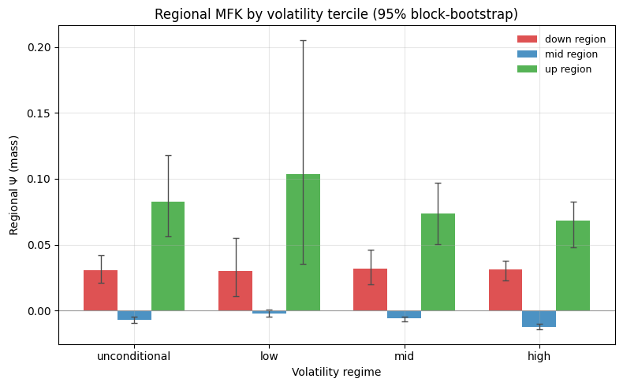
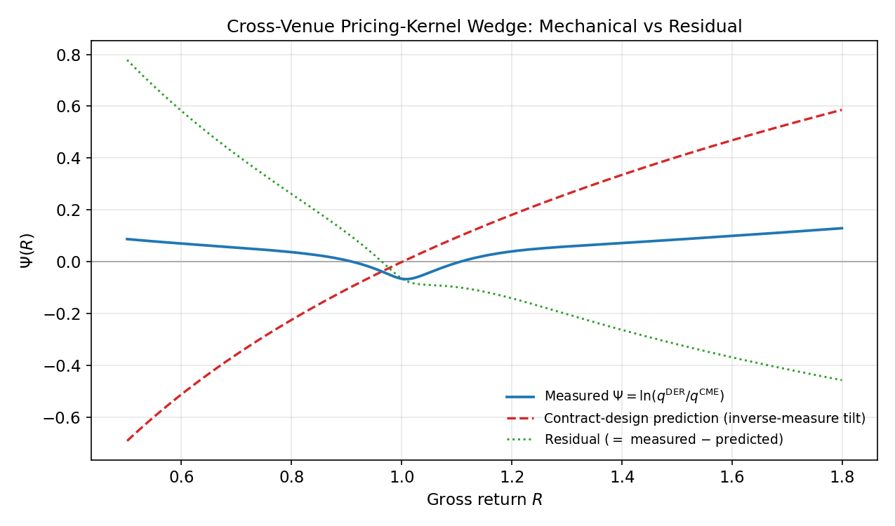
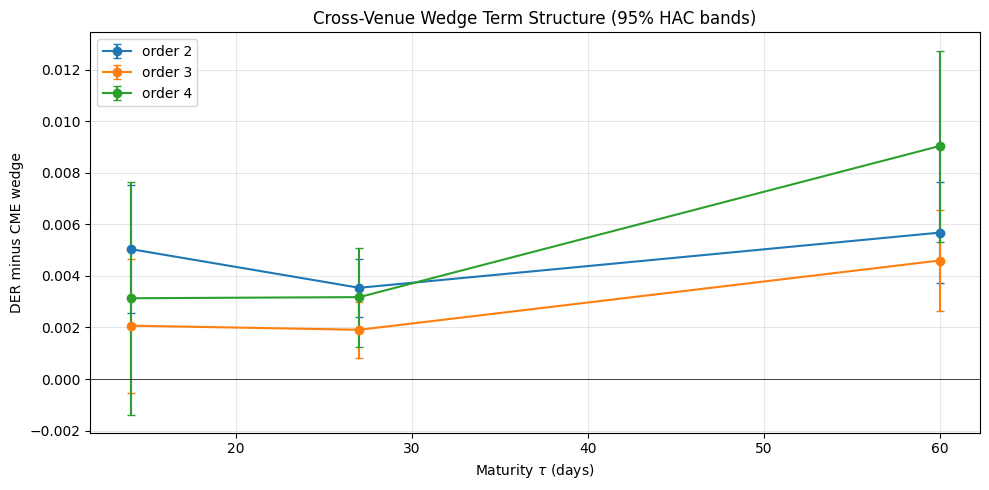

```python
import pandas as pd
import numpy as np
import matplotlib.pyplot as plt
from pathlib import Path
import sys
from IPython.display import display, Image

project_root = Path.cwd().parent
if str(project_root) not in sys.path:
    sys.path.append(str(project_root))
```


```python
from src.config import get_path

plt.rcParams['figure.figsize'] = (13, 5)
plt.rcParams['axes.grid'] = True
plt.rcParams['grid.alpha'] = 0.3

# Centralized Path Registry Resolution
DATA_P1 = get_path("data_phase1")
DATA_P3 = get_path("data_phase3")
DATA_P5 = get_path("data_phase5")
RES_P3 = get_path("results_phase3")
RES_P5 = get_path("results_phase5")

PHASE5_FIG = RES_P5 / "figures"
PHASE5_TAB = RES_P5 / "tables"
PHASE3_TAB = RES_P3 / "tables"

# Cross-venue outputs
wedge_md   = pd.read_csv(PHASE5_TAB / "matched_difference_regressions.csv")
panel_dk   = pd.read_csv(PHASE5_TAB / "panel_regressions_dk.csv")
regional   = pd.read_csv(PHASE5_TAB / "regional_mfk_summary.csv")

# Extension 1 (inverse-contract) + joint regime test
inv_wedge  = pd.read_csv(PHASE5_TAB / "inverse_contract_wedge.csv")
inv_daily  = pd.read_csv(PHASE5_TAB / "inverse_contract_daily.csv")
joint      = pd.read_csv(PHASE3_TAB / "joint_regime_test_crypto.csv")
joint_det  = pd.read_csv(PHASE3_TAB / "joint_regime_detail_crypto.csv")

def show_table(path, cols=None, title=None, rounding=4, sort=None, produced_by=None):
    """Display a results CSV defensively."""
    from pathlib import Path
    path = Path(path)
    if not path.exists():
        msg = f"[not found] {path}"
        if produced_by:
            msg += f"\n              run {produced_by} to produce it"
        print(msg)
        return None
    df = pd.read_csv(path)
    if title:
        print(f"--- {title} ---")
    if sort:
        keep = [c for c in sort if c in df.columns]
        if keep:
            df = df.sort_values(keep)
    if cols:
        avail = [c for c in cols if c in df.columns]
        missing = [c for c in cols if c not in df.columns]
        if missing:
            print(f"[note] columns absent from file: {missing}")
        if avail:
            df_show = df[avail]
        else:
            print("[note] none of the requested columns present — showing all")
            df_show = df
    else:
        df_show = df
    print(df_show.round(rounding).to_string(index=False))
    print(f"\n[{len(df)} rows]  source: {path.name}")
    return df
```

> **Note on sample sizes.** Cell counts differ by data requirement, not by filtering choices: the CL20 wedge regressions require BKM extractions on both venues; the MFK requires a valid daily RND on both venues; the friction-proxy regressions additionally require CME basis and Deribit funding data. Each analysis uses the largest sample its inputs permit - the exact counts are printed by each table below and should be quoted from there.

#### 1. Cross-venue cumulant-premium wedge (matched-difference)


```python
venue_wedge = wedge_md[wedge_md["regressor"] == "const (venue wedge)"].copy()
display(venue_wedge[["dep_var", "coef", "se", "t_stat", "p_value", "stars"]]
        .reset_index(drop=True))

# State interactions: confirm none significant (the wedge is a level effect)
inter = wedge_md[wedge_md["regressor"].isin(["Z_IVS_1", "rv", "fng"])]
print("State interactions (should all be insignificant -> constant level wedge):")
for dv in ["Pi_2", "Pi_3", "Pi_4"]:
    sub = inter[inter["dep_var"] == dv]
    sig = (sub["p_value"] < 0.05).any()
    print(f"  {dv}: any state interaction significant at 5%? {bool(sig)}")
```


<div>
<style scoped>
    .dataframe tbody tr th:only-of-type {
        vertical-align: middle;
    }

    .dataframe tbody tr th {
        vertical-align: top;
    }

    .dataframe thead th {
        text-align: right;
    }
</style>
<table border="1" class="dataframe">
  <thead>
    <tr style="text-align: right;">
      <th></th>
      <th>dep_var</th>
      <th>coef</th>
      <th>se</th>
      <th>t_stat</th>
      <th>p_value</th>
      <th>stars</th>
    </tr>
  </thead>
  <tbody>
    <tr>
      <th>0</th>
      <td>Pi_2</td>
      <td>0.003571</td>
      <td>0.000417</td>
      <td>8.557052</td>
      <td>1.157902e-17</td>
      <td>***</td>
    </tr>
    <tr>
      <th>1</th>
      <td>Pi_3</td>
      <td>0.001959</td>
      <td>0.000573</td>
      <td>3.419211</td>
      <td>6.280294e-04</td>
      <td>***</td>
    </tr>
    <tr>
      <th>2</th>
      <td>Pi_4</td>
      <td>0.003264</td>
      <td>0.001039</td>
      <td>3.140777</td>
      <td>1.685005e-03</td>
      <td>***</td>
    </tr>
  </tbody>
</table>
</div>


    State interactions (should all be insignificant -> constant level wedge):
      Pi_2: any state interaction significant at 5%? False
      Pi_3: any state interaction significant at 5%? False
      Pi_4: any state interaction significant at 5%? False
    

#### 2. Conditional / regional MFK by volatility tercile (95% bootstrap bands)


```python
display(regional[["regime", "n_days", "mean_down", "lo_down", "hi_down",
                  "mean_mid", "lo_mid", "hi_mid",
                  "mean_up", "lo_up", "hi_up"]].round(4))

fig, ax = plt.subplots(figsize=(8, 5))
regimes = regional["regime"].tolist()
x = np.arange(len(regimes))
w = 0.25
for k, (reg, col) in enumerate([("down", "C3"), ("mid", "C0"), ("up", "C2")]):
    m = regional[f"mean_{reg}"].values
    lo = regional[f"lo_{reg}"].values
    hi = regional[f"hi_{reg}"].values
    ax.bar(x + (k-1)*w, m, w, color=col, alpha=0.8, label=f"{reg} region")
    ax.errorbar(x + (k-1)*w, m, yerr=[m-lo, hi-m], fmt="none",
                ecolor="0.3", capsize=3, lw=1)
ax.axhline(0, color="0.6", lw=0.8)
ax.set_xticks(x); ax.set_xticklabels(regimes)
ax.set_ylabel(r"Regional $\Psi$ (mass)"); ax.set_xlabel("Volatility regime")
ax.set_title("Regional MFK by volatility tercile (95% block-bootstrap)")
ax.legend(frameon=False, fontsize=9)
plt.tight_layout()
plt.savefig(PHASE5_FIG / "fig_regional_mfk.png", dpi=300)
plt.show()
```


<div>
<style scoped>
    .dataframe tbody tr th:only-of-type {
        vertical-align: middle;
    }

    .dataframe tbody tr th {
        vertical-align: top;
    }

    .dataframe thead th {
        text-align: right;
    }
</style>
<table border="1" class="dataframe">
  <thead>
    <tr style="text-align: right;">
      <th></th>
      <th>regime</th>
      <th>n_days</th>
      <th>mean_down</th>
      <th>lo_down</th>
      <th>hi_down</th>
      <th>mean_mid</th>
      <th>lo_mid</th>
      <th>hi_mid</th>
      <th>mean_up</th>
      <th>lo_up</th>
      <th>hi_up</th>
    </tr>
  </thead>
  <tbody>
    <tr>
      <th>0</th>
      <td>unconditional</td>
      <td>619</td>
      <td>0.0308</td>
      <td>0.0210</td>
      <td>0.0417</td>
      <td>-0.0069</td>
      <td>-0.0093</td>
      <td>-0.0045</td>
      <td>0.0827</td>
      <td>0.0565</td>
      <td>0.1182</td>
    </tr>
    <tr>
      <th>1</th>
      <td>low</td>
      <td>223</td>
      <td>0.0298</td>
      <td>0.0106</td>
      <td>0.0554</td>
      <td>-0.0024</td>
      <td>-0.0049</td>
      <td>0.0004</td>
      <td>0.1038</td>
      <td>0.0353</td>
      <td>0.2055</td>
    </tr>
    <tr>
      <th>2</th>
      <td>mid</td>
      <td>191</td>
      <td>0.0318</td>
      <td>0.0198</td>
      <td>0.0458</td>
      <td>-0.0062</td>
      <td>-0.0082</td>
      <td>-0.0046</td>
      <td>0.0735</td>
      <td>0.0501</td>
      <td>0.0969</td>
    </tr>
    <tr>
      <th>3</th>
      <td>high</td>
      <td>205</td>
      <td>0.0309</td>
      <td>0.0230</td>
      <td>0.0376</td>
      <td>-0.0124</td>
      <td>-0.0145</td>
      <td>-0.0099</td>
      <td>0.0682</td>
      <td>0.0481</td>
      <td>0.0826</td>
    </tr>
  </tbody>
</table>
</div>


    

    


#### 3. Extension 1 — Inverse-contract numeraire prediction

Deribit is coin-margined (inverse) -> BTC-numeraire measure = unit Esscher tilt of the CME density. Parameter-free predicted wedge vs measured wedge. **Predicted negative, measured positive at every order: contract design predicts the wrong sign.**


```python
display(inv_wedge[["cumulant", "predicted_wedge", "pred_ci_lo", "pred_ci_hi",
                   "measured_wedge", "meas_ci_lo", "meas_ci_hi", "residual"]].round(5))

agree = int(np.sum(np.sign(inv_wedge["predicted_wedge"]) ==
                   np.sign(inv_wedge["measured_wedge"])))
print(f"Sign agreement: {agree}/{len(inv_wedge)} cumulants.")
print("Contract design predicts the WRONG sign -> the friction is real and "
      "amplified (residual > measured at every order).")

# The Psi overlay decomposition figure (mechanical vs residual)
img = PHASE5_FIG / "fig_inverse_contract_psi.png"
if img.exists():
    display(Image(filename=str(img)))
else:
    print(f"[figure not found: run run_inverse_contract.py] {img}")
```


<div>
<style scoped>
    .dataframe tbody tr th:only-of-type {
        vertical-align: middle;
    }

    .dataframe tbody tr th {
        vertical-align: top;
    }

    .dataframe thead th {
        text-align: right;
    }
</style>
<table border="1" class="dataframe">
  <thead>
    <tr style="text-align: right;">
      <th></th>
      <th>cumulant</th>
      <th>predicted_wedge</th>
      <th>pred_ci_lo</th>
      <th>pred_ci_hi</th>
      <th>measured_wedge</th>
      <th>meas_ci_lo</th>
      <th>meas_ci_hi</th>
      <th>residual</th>
    </tr>
  </thead>
  <tbody>
    <tr>
      <th>0</th>
      <td>Pi_2</td>
      <td>-0.00367</td>
      <td>-0.00512</td>
      <td>-0.00230</td>
      <td>0.00292</td>
      <td>0.00205</td>
      <td>0.00384</td>
      <td>0.00659</td>
    </tr>
    <tr>
      <th>1</th>
      <td>Pi_3</td>
      <td>-0.01599</td>
      <td>-0.02068</td>
      <td>-0.01199</td>
      <td>0.00092</td>
      <td>0.00053</td>
      <td>0.00131</td>
      <td>0.01690</td>
    </tr>
    <tr>
      <th>2</th>
      <td>Pi_4</td>
      <td>-0.00374</td>
      <td>-0.00529</td>
      <td>-0.00222</td>
      <td>0.00139</td>
      <td>0.00075</td>
      <td>0.00203</td>
      <td>0.00513</td>
    </tr>
  </tbody>
</table>
</div>


    Sign agreement: 0/3 cumulants.
    Contract design predicts the WRONG sign -> the friction is real and amplified (residual > measured at every order).
    


    

    


#### 4. Joint regime test (Phase 3 follow-up)

The marginal curvature c is collinear (insignificant per-tercile), so the joint test of H₀: (b,c,d)_low = (b,c,d)_high is the correct question. **Significant at both venues; the low-vol kernel is more concave at the money (2c+6d).**


```python
display(joint[["venue", "wald_stat", "p_value",
               "delta_b", "delta_c", "delta_d", "frac_vector_consistent"]].round(4))

curv = joint_det[joint_det["test"] == "curv_at_money_diff"]
print("Curvature at money (2c+6d at R=1), low - high:")
for _, r in curv.iterrows():
    print(f"  {r['venue']}: {r['diff_point']:+.2f} "
          f"[{r['ci_lo']:+.2f}, {r['ci_hi']:+.2f}]  P(<0) = {r['frac_negative']:.3f}")
print("\nThe kernel significantly depends on the volatility regime; the low-vol "
      "kernel is significantly more concave at the money (P<0 = 1.000 both venues).")
```


<div>
<style scoped>
    .dataframe tbody tr th:only-of-type {
        vertical-align: middle;
    }

    .dataframe tbody tr th {
        vertical-align: top;
    }

    .dataframe thead th {
        text-align: right;
    }
</style>
<table border="1" class="dataframe">
  <thead>
    <tr style="text-align: right;">
      <th></th>
      <th>venue</th>
      <th>wald_stat</th>
      <th>p_value</th>
      <th>delta_b</th>
      <th>delta_c</th>
      <th>delta_d</th>
      <th>frac_vector_consistent</th>
    </tr>
  </thead>
  <tbody>
    <tr>
      <th>0</th>
      <td>CME</td>
      <td>18.876</td>
      <td>0.019</td>
      <td>12.8816</td>
      <td>-7.6268</td>
      <td>0.9115</td>
      <td>0.917</td>
    </tr>
    <tr>
      <th>1</th>
      <td>DER</td>
      <td>10.663</td>
      <td>0.045</td>
      <td>13.0792</td>
      <td>-8.0150</td>
      <td>1.0874</td>
      <td>0.975</td>
    </tr>
  </tbody>
</table>
</div>


    Curvature at money (2c+6d at R=1), low - high:
      CME: -9.78 [-20.12, -7.45]  P(<0) = 1.000
      DER: -9.51 [-19.45, -7.09]  P(<0) = 1.000
    
    The kernel significantly depends on the volatility regime; the low-vol kernel is significantly more concave at the money (P<0 = 1.000 both venues).
    

#### 5. Friction Regressions: does the wedge load on basis or funding?


```python
show_table(
    PHASE5_TAB / "friction_regressions.csv",
    cols=["dep_var", "spec", "regressor", "coef", "se", "t_stat",
          "p_value", "stars", "r2", "n"],
    title="Wedge on CME basis and Deribit funding (HAC)",
    sort=["dep_var", "spec"],
    produced_by="run_friction_regressions.py",
)

show_table(
    PHASE5_TAB / "friction_proxies_daily.csv",
    title="Daily friction proxies (head)",
    produced_by="run_friction_regressions.py",
)
```

    --- Wedge on CME basis and Deribit funding (HAC) ---
    dep_var         spec   regressor    coef     se  t_stat  p_value stars     r2   n
     d_Pi_2   basis_only       const  0.0035 0.0006  6.1070   0.0000   *** 0.0034 621
     d_Pi_2   basis_only   cme_basis  0.0006 0.0006  0.9044   0.3658   NaN 0.0034 621
     d_Pi_2 funding_only       const  0.0035 0.0006  5.8778   0.0000   *** 0.0138 621
     d_Pi_2 funding_only der_funding -0.0011 0.0012 -0.9100   0.3628   NaN 0.0138 621
     d_Pi_2        joint       const  0.0035 0.0006  5.8730   0.0000   *** 0.0194 621
     d_Pi_2        joint   cme_basis  0.0007 0.0006  1.2125   0.2253   NaN 0.0194 621
     d_Pi_2        joint der_funding -0.0012 0.0012 -1.0091   0.3129   NaN 0.0194 621
     d_Pi_3   basis_only       const  0.0019 0.0006  3.4490   0.0006   *** 0.0012 621
     d_Pi_3   basis_only   cme_basis  0.0005 0.0008  0.5960   0.5512   NaN 0.0012 621
     d_Pi_3 funding_only       const  0.0019 0.0006  3.2176   0.0013   *** 0.0351 621
     d_Pi_3 funding_only der_funding -0.0025 0.0020 -1.2992   0.1939   NaN 0.0351 621
     d_Pi_3        joint       const  0.0019 0.0006  3.2261   0.0013   *** 0.0388 621
     d_Pi_3        joint   cme_basis  0.0008 0.0006  1.3122   0.1894   NaN 0.0388 621
     d_Pi_3        joint der_funding -0.0027 0.0019 -1.3846   0.1662   NaN 0.0388 621
     d_Pi_4   basis_only       const  0.0032 0.0010  3.2407   0.0012   *** 0.0000 621
     d_Pi_4   basis_only   cme_basis  0.0001 0.0014  0.0796   0.9366   NaN 0.0000 621
     d_Pi_4 funding_only       const  0.0032 0.0011  3.0249   0.0025   *** 0.0318 621
     d_Pi_4 funding_only der_funding -0.0044 0.0035 -1.2461   0.2127   NaN 0.0318 621
     d_Pi_4        joint       const  0.0032 0.0010  3.0341   0.0024   *** 0.0326 621
     d_Pi_4        joint   cme_basis  0.0007 0.0012  0.5822   0.5604   NaN 0.0326 621
     d_Pi_4        joint der_funding -0.0045 0.0035 -1.2962   0.1949   NaN 0.0326 621
    
    [21 rows]  source: friction_regressions.csv
    --- Daily friction proxies (head) ---
          date  d_Pi_2  d_Pi_3  d_Pi_4  cme_basis  der_funding  cme_basis_z  der_funding_z
    2020-01-16  0.0059  0.0030  0.0038     0.1540       0.3392       0.4935         1.2026
    2020-01-17  0.0057  0.0019  0.0035    -0.0097       0.3801      -0.1640         1.3857
    2020-01-21  0.0046  0.0018  0.0028     0.0132       0.2347      -0.0720         0.7356
    2020-01-23  0.0025  0.0022  0.0021     0.0262       0.1578      -0.0199         0.3918
    2020-01-24  0.0025  0.0013  0.0013     0.1133       0.1239       0.3300         0.2400
    2020-01-29  0.0029  0.0018  0.0021     0.2475       0.5558       0.8690         2.1713
    2020-01-30 -0.0009  0.0009  0.0008     0.2653       0.5579       0.9403         2.1803
    2020-01-31  0.0006  0.0005  0.0003     0.1127       0.4414       0.3277         1.6598
    2020-02-03  0.0064  0.0025  0.0036     0.1635       0.2914       0.5315         0.9890
    2020-02-04  0.0071  0.0026  0.0044     0.1091       0.2614       0.3131         0.8550
    2020-02-05  0.0058  0.0001  0.0027     0.3165       0.5093       1.1458         1.9631
    2020-02-06  0.0071  0.0007  0.0030     0.2481       0.7136       0.8711         2.8768
    2020-02-07  0.0088  0.0027  0.0059     0.0762       0.4799       0.1811         1.8317
    2020-02-10  0.0051 -0.0008  0.0013     0.1383       0.5105       0.4305         1.9687
    2020-02-11  0.0056  0.0006  0.0040     0.3520       0.4494       1.2885         1.6956
    2020-02-12  0.0051  0.0009  0.0040     0.3704       0.8992       1.3622         3.7065
    2020-02-13  0.0075  0.0018  0.0052     0.1800       0.8495       0.5979         3.4841
    2020-02-14  0.0057  0.0006  0.0034     0.3810       0.8869       1.4051         3.6514
    2020-02-18  0.0059  0.0008  0.0035     0.2992       0.3186       1.0765         1.1108
    2020-02-20 -0.0011 -0.0030 -0.0038     0.1477       0.1956       0.4681         0.5604
    2020-02-26 -0.0011  0.0001 -0.0011     0.0809       0.5667       0.1999         2.2199
    2020-02-27 -0.0055 -0.0038 -0.0040     0.2086       0.0378       0.7125        -0.1450
    2020-03-02  0.0039 -0.0011  0.0031     0.1549       0.0964       0.4971         0.1172
    2020-03-06  0.0030 -0.0009  0.0008     0.0708      -0.0015       0.1594        -0.3208
    2020-03-09 -0.0162 -0.0285 -0.0439    -0.1617      -0.0247      -0.7741        -0.4242
    2020-03-10 -0.0022 -0.0102 -0.0132     0.1969      -0.0102       0.6656        -0.3595
    2020-03-11 -0.0193 -0.0363 -0.0553    -0.1371      -0.0018      -0.6756        -0.3218
    2020-03-16  0.1552  0.2875  0.5258    -0.4395      -0.8009      -1.8899        -3.8949
    2020-03-17  0.0560  0.0822  0.1407     0.8300      -0.8158       3.2078        -3.9616
    2020-03-19 -0.0162 -0.0353 -0.0608     0.1192      -0.3628       0.3537        -1.9360
    2020-03-25  0.0059  0.0023  0.0053    -0.0349      -0.2516      -0.2651        -1.4388
    2020-03-26  0.0035  0.0032  0.0060    -0.0364      -0.1888      -0.2713        -1.1579
    2020-03-30  0.0171  0.0216  0.0447    -0.1011      -0.0607      -0.5310        -0.5852
    2020-04-01  0.0098 -0.0005  0.0028    -0.8437      -0.0890      -3.5127        -0.7121
    2020-04-02  0.0091  0.0126  0.0215     0.1535      -0.0102       0.4914        -0.3596
    2020-04-06  0.0061  0.0004  0.0022     0.1392      -0.0063       0.4342        -0.3422
    2020-04-13 -0.0049 -0.0250 -0.0447    -0.1335      -0.3599      -0.6612        -1.9232
    2020-04-16 -0.0042 -0.0100 -0.0204    -0.0551      -0.1459      -0.3461        -0.9663
    2020-04-29 -0.0156 -0.0154 -0.0274     0.0301      -0.0143      -0.0040        -0.3778
    2020-05-01 -0.0021  0.0010 -0.0000    -0.0329       0.0034      -0.2572        -0.2988
    2020-05-04  0.0074  0.0066  0.0133     0.0327      -0.0183       0.0064        -0.3956
    2020-05-05  0.0149  0.0191  0.0297    -0.0272      -0.0080      -0.2340        -0.3498
    2020-05-07  0.0038  0.0026  0.0021     0.0859      -0.0209       0.2198        -0.4075
    2020-05-18  0.0146  0.0071  0.0134     0.0494       0.1276       0.0735         0.2567
    2020-05-19  0.0083  0.0059  0.0091    -0.1416       0.0234      -0.6936        -0.2095
    2020-05-22 -0.0020 -0.0123 -0.0222     0.0758      -0.0142       0.1794        -0.3772
    2020-05-27  0.0011 -0.0011 -0.0031     0.0832      -0.0092       0.2090        -0.3548
    2020-05-28 -0.0072 -0.0031 -0.0056     0.0410       0.0022       0.0398        -0.3039
    2020-05-29 -0.0003 -0.0016 -0.0018     0.0385       0.0308       0.0298        -0.1760
    2020-06-02  0.0060  0.0045  0.0052     0.0713       0.4713       0.1611         1.7934
    2020-06-03  0.0101  0.0044  0.0083    -0.0025       0.0005      -0.1350        -0.3117
    2020-06-04  0.0095  0.0047  0.0084     0.1407       0.0036       0.4399        -0.2976
    2020-06-08  0.0078  0.0031  0.0062     0.0151       0.0161      -0.0641        -0.2418
    2020-06-09  0.0083  0.0038  0.0074     0.0173       0.0019      -0.0554        -0.3054
    2020-06-11  0.0077  0.0049  0.0057    -0.0474       0.0400      -0.3154        -0.1351
    2020-06-12  0.0051  0.0012  0.0009    -0.0359      -0.0041      -0.2692        -0.3321
    2020-06-15  0.0091  0.0047  0.0097    -0.0295       0.0146      -0.2436        -0.2484
    2020-06-18  0.0055  0.0045  0.0050    -0.0065       0.0220      -0.1511        -0.2157
    2020-06-19  0.0027  0.0005 -0.0001     0.1061       0.0112       0.3011        -0.2637
    2020-07-01  0.0020  0.0019  0.0020     0.1159      -0.0021       0.3406        -0.3232
    2020-07-02 -0.0003  0.0010  0.0003    -0.0793      -0.0046      -0.4435        -0.3344
    2020-07-06  0.0056  0.0024  0.0045    -0.0285       0.0039      -0.2394        -0.2963
    2020-07-07  0.0086  0.0014  0.0064     0.0552       0.0063       0.0965        -0.2860
    2020-07-08  0.0063  0.0006  0.0039     0.1217       0.0203       0.3636        -0.2230
    2020-07-09  0.0050  0.0008  0.0031    -0.0362       0.0253      -0.2702        -0.2009
    2020-07-10  0.0055  0.0013  0.0024    -0.0062       0.0216      -0.1501        -0.2174
    2020-07-13  0.0041  0.0005  0.0014     0.0496       0.0927       0.0744         0.1006
    2020-07-14  0.0039  0.0010  0.0012     0.1320       0.0400       0.4049        -0.1351
    2020-07-15  0.0051  0.0015  0.0020    -0.0059       0.0591      -0.1488        -0.0496
    2020-07-16  0.0046  0.0007  0.0014     0.0284       0.0239      -0.0110        -0.2071
    2020-07-17  0.0034 -0.0000  0.0000     0.1024       0.0006       0.2861        -0.3112
    2020-07-20  0.0045  0.0010  0.0024     0.0734       0.1181       0.1696         0.2142
    2020-07-21  0.0025 -0.0000 -0.0005     0.0603       0.0426       0.1171        -0.1235
    2020-07-24  0.0020  0.0007  0.0005     0.1543       0.0955       0.4947         0.1131
    2020-07-30 -0.0020  0.0002 -0.0020     0.2658       0.2777       0.9425         0.9279
    2020-08-03  0.0064  0.0019  0.0041     0.4334       0.1112       1.6153         0.1833
    2020-08-05  0.0063  0.0016  0.0051     0.1231       0.0920       0.3695         0.0975
    2020-08-06  0.0139  0.0100  0.0159     0.3227       0.0554       1.1710        -0.0662
    2020-08-10  0.0065  0.0028  0.0050     0.2004       0.2484       0.6799         0.7965
    2020-08-13  0.0022 -0.0030 -0.0024    -0.3343       0.0603      -1.4673        -0.0443
    2020-08-17  0.0122  0.0089  0.0131     0.4909       0.5510       1.8464         2.1496
    2020-08-18  0.0164  0.0151  0.0208     0.1025       0.3896       0.2868         1.4279
    2020-08-20  0.0125  0.0108  0.0171     0.1393       0.0542       0.4342        -0.0714
    2020-09-01  0.0088  0.0020  0.0067     0.1181       0.3502       0.3493         1.2519
    2020-09-03  0.0138  0.0123  0.0160     0.6769      -0.0145       2.5932        -0.3789
    2020-09-04  0.0045 -0.0003  0.0017     0.1566      -0.0993       0.5040        -0.7578
    2020-09-09  0.0078  0.0031  0.0038     0.1457       0.0015       0.4603        -0.3070
    2020-09-14 -0.0042 -0.0034 -0.0066     0.0590       0.0004       0.1120        -0.3123
    2020-09-15 -0.0032 -0.0031 -0.0062     0.0470       0.0069       0.0636        -0.2832
    2020-09-16 -0.0018 -0.0025 -0.0041     0.1112       0.0229       0.3215        -0.2114
    2020-09-18 -0.0048 -0.0016 -0.0039    -0.2155       0.0798      -0.9905         0.0430
    2020-10-01 -0.0070 -0.0034 -0.0066     0.0275       0.0140      -0.0147        -0.2513
    2020-10-02 -0.0037 -0.0035 -0.0049    -0.0289       0.0005      -0.2412        -0.3115
    2020-10-05  0.0031 -0.0005  0.0008     0.0262       0.0001      -0.0199        -0.3136
    2020-10-06  0.0113  0.0062  0.0097     0.0326       0.0007       0.0061        -0.3106
    2020-10-08  0.0077  0.0024  0.0046     0.0526       0.0174       0.0863        -0.2362
    2020-10-09  0.0058  0.0021  0.0040     0.0626       0.1312       0.1266         0.2728
    2020-10-12  0.0072  0.0030  0.0034     0.1123       0.1418       0.3261         0.3202
    2020-10-14  0.0056  0.0023  0.0028    -0.0328       0.0029      -0.2567        -0.3009
    2020-10-15  0.0001 -0.0009 -0.0015     0.1759       0.0033       0.5814        -0.2991
    2020-10-22  0.0013  0.0023  0.0024     0.2160       0.0616       0.7426        -0.0387
    2020-10-28  0.0050  0.0096  0.0105     0.0907      -0.0014       0.2391        -0.3202
    2020-10-29 -0.0004  0.0066  0.0042     0.2906      -0.0134       1.0419        -0.3737
    2020-11-02  0.0042  0.0061  0.0068     0.2306       0.0021       0.8009        -0.3047
    2020-11-19 -0.0038  0.0061 -0.0051     0.2223       0.1329       0.7677         0.2803
    2020-11-30 -0.0051 -0.0037  0.0004     0.0692       0.4896       0.1530         1.8751
    2020-12-01  0.0046  0.0036  0.0090     0.3396       0.6805       1.2386         2.7286
    2020-12-02  0.0095  0.0030  0.0120     0.0687       0.1669       0.1509         0.4324
    2020-12-07  0.0048  0.0021  0.0035    -0.0196       0.2433      -0.2037         0.7739
    2020-12-10 -0.0048 -0.0041 -0.0085     0.1944       0.0176       0.6557        -0.2354
    2020-12-14  0.0011  0.0018 -0.0002     0.0317       0.2711       0.0021         0.8984
    2020-12-16  0.0038 -0.0001  0.0012    -0.5436       0.3752      -2.3078         1.3637
    2020-12-17 -0.0040 -0.0027  0.0011     0.0944       0.8539       0.2541         3.5039
    2020-12-18 -0.0005  0.0000 -0.0012    -0.4388       0.6982      -1.8869         2.8080
    2021-01-05 -0.0282 -0.0167 -0.0352     0.2080       0.3204       0.7101         1.1186
    2021-01-07 -0.0393 -0.0258 -0.0747     0.0942       0.4182       0.2534         1.5561
    2021-01-11 -0.0123 -0.0206 -0.0319    -0.8737       1.8468      -3.6333         7.9435
    2021-01-13  0.0154 -0.0052  0.0049    -0.4849       0.4182      -2.0723         1.5560
    2021-01-15  0.0072 -0.0109  0.0156    -0.7003       0.7026      -2.9372         2.8277
    2021-01-20  0.0248  0.0180  0.0286    -0.0200       0.0184      -0.2052        -0.2315
    2021-01-21  0.0025  0.0044 -0.0033     0.4449       0.2390       1.6614         0.7548
    2021-01-28 -0.0138 -0.0130 -0.0275    -0.2306       0.0070      -1.0509        -0.2827
    2021-02-01  0.0130  0.0027  0.0113     0.1800       0.1830       0.5979         0.5041
    2021-02-02  0.0140  0.0131  0.0283     0.2513       0.3913       0.8842         1.4358
    2021-02-03  0.0162  0.0092  0.0249    -0.0308       0.4496      -0.2486         1.6965
    2021-02-04  0.0146  0.0143  0.0252     0.3913       0.3651       1.4462         1.3185
    2021-02-05  0.0093  0.0094  0.0187    -0.0516       0.4087      -0.3321         1.5135
    2021-02-08  0.0096 -0.0020  0.0022    -0.5427       0.6166      -2.3042         2.4430
    2021-02-10  0.0196  0.0144  0.0284    -0.0014       0.3663      -0.1304         1.3240
    2021-02-11  0.0044 -0.0042 -0.0106    -0.1628       0.3722      -0.7786         1.3504
    2021-02-12  0.0052 -0.0062 -0.0111     0.2420       0.6423       0.8469         2.5580
    2021-02-17  0.0115  0.0046 -0.0057     0.3712       1.1861       1.3656         4.9892
    2021-02-18 -0.0032 -0.0087 -0.0214     0.2701       1.0776       0.9594         4.5043
    2021-02-24 -0.0088 -0.0018 -0.0062     0.0244       0.0843      -0.0269         0.0631
    2021-03-01  0.0072  0.0081  0.0083    -0.2001       0.2150      -0.9284         0.6474
    2021-03-02  0.0155  0.0146  0.0165    -0.1563       0.1306      -0.7526         0.2702
    2021-03-03  0.0075  0.0092  0.0124     0.1006       0.1885       0.2788         0.5288
    2021-03-04  0.0036  0.0049  0.0090    -0.0756       0.0349      -0.4284        -0.1579
    2021-03-05  0.0119  0.0143  0.0190     0.1952       0.0445       0.6590        -0.1149
    2021-03-08  0.0138  0.0094  0.0190    -0.0338       0.1942      -0.2607         0.5543
    2021-03-09  0.0193  0.0125  0.0245    -0.0347       0.4136      -0.2642         1.5354
    2021-03-10  0.0076  0.0065  0.0078     0.2099       0.1605       0.7177         0.4036
    2021-03-12  0.0052  0.0011  0.0015    -0.0963       0.5034      -0.5118         1.9370
    2021-03-15  0.0086  0.0075  0.0073     0.4633       0.3120       1.7354         1.0812
    2021-03-16 -0.0020 -0.0067 -0.0129    -0.4426       0.1373      -1.9023         0.2998
    2021-03-17  0.0019 -0.0032 -0.0020    -0.4606       0.0512      -1.9745        -0.0848
    2021-03-18 -0.0122 -0.0152 -0.0304    -0.2835       0.3198      -1.2632         1.1160
    2021-03-19 -0.0170 -0.0155 -0.0476     0.3933       0.0612       1.4545        -0.0403
    2021-04-01 -0.0043  0.0004 -0.0031     0.1003       0.8444       0.2777         3.4615
    2021-04-05  0.0056  0.0017  0.0049     0.1728       0.4648       0.5687         1.7643
    2021-04-06  0.0092  0.0065  0.0103     0.1261       0.8727       0.3816         3.5882
    2021-04-08  0.0049  0.0004  0.0042    -0.0423       0.1224      -0.2949         0.2333
    2021-04-12  0.0043  0.0004  0.0002     0.1892       0.9652       0.6348         4.0017
    2021-04-13  0.0066 -0.0002  0.0034     0.0522       0.9754       0.0847         4.0474
    2021-04-14  0.0068  0.0030  0.0065    -0.2162       0.3207      -0.9930         1.1200
    2021-04-15 -0.0006 -0.0036 -0.0029     0.1686       0.1014       0.5519         0.1396
    2021-04-16  0.0005 -0.0022 -0.0033     0.1421       0.0981       0.4456         0.1246
    2021-04-19 -0.0060 -0.0084 -0.0167     0.1502       0.0257       0.4780        -0.1989
    2021-04-20  0.0016  0.0007  0.0018     0.1204       0.0466       0.3584        -0.1054
    2021-04-21  0.0056  0.0059  0.0051     0.3411       0.0498       1.2446        -0.0913
    2021-04-22  0.0096  0.0088  0.0106     0.2298       0.1889       0.7978         0.5307
    2021-04-23  0.0091  0.0040  0.0071    -0.0089      -0.0124      -0.1608        -0.3693
    2021-05-03 -0.0007  0.0035  0.0036     0.1243       0.3868       0.3743         1.4157
    2021-05-04  0.0008  0.0042  0.0066     0.2890       0.0880       1.0354         0.0797
    2021-05-05  0.0045  0.0013  0.0053    -0.0304       0.0669      -0.2470        -0.0149
    2021-05-06  0.0106  0.0101  0.0149    -0.0539       0.1746      -0.3415         0.4669
    2021-05-11  0.0122  0.0085  0.0157     0.0308       0.2386      -0.0013         0.7531
    2021-05-12  0.0127  0.0111  0.0136     1.9672       0.1333       7.7743         0.2819
    2021-05-13  0.0014 -0.0063 -0.0078    -0.5225       0.1066      -2.2229         0.1627
    2021-05-14 -0.0037 -0.0009 -0.0032     0.1259       0.1998       0.3805         0.5793
    2021-05-17  0.0315  0.0257  0.0412     0.2922      -0.6656       1.0484        -3.2898
    2021-05-18  0.0154  0.0153  0.0200     0.1463       0.0042       0.4624        -0.2952
    2021-05-19  0.0358  0.0293  0.0523     0.6163      -0.5936       2.3499        -2.9678
    2021-05-20  0.0043 -0.0001 -0.0056    -0.0994      -0.3073      -0.5240        -1.6880
    2021-05-21 -0.0093 -0.0061 -0.0251    -0.2872      -0.0272      -1.2782        -0.4357
    2021-05-26 -0.0072 -0.0090 -0.0112    -0.1927       0.1059      -0.8988         0.1596
    2021-06-01  0.0149  0.0144  0.0282    -0.2563       0.0843      -1.1540         0.0628
    2021-06-02  0.0202  0.0150  0.0284     0.1738       0.0459       0.5728        -0.1085
    2021-06-03  0.0148  0.0105  0.0228    -0.1840       0.0126      -0.8638        -0.2574
    2021-06-04  0.0181  0.0149  0.0290     0.0250       0.1268      -0.0246         0.2529
    2021-06-07  0.0281  0.0303  0.0483     1.0802       0.0186       4.2125        -0.2309
    2021-06-09  0.0010  0.0043 -0.0272    -0.4994      -0.0000      -2.1302        -0.3140
    2021-06-10  0.0094  0.0057  0.0053    -0.0070      -0.0066      -0.1529        -0.3435
    2021-06-14  0.0078  0.0019  0.0024    -0.3298       0.0373      -1.4494        -0.1473
    2021-06-15  0.0019 -0.0044 -0.0076    -0.2860       0.0029      -1.2733        -0.3009
    2021-06-16  0.0071  0.0049  0.0033     0.1730      -0.0142       0.5696        -0.3776
    2021-06-17 -0.0017 -0.0018 -0.0062    -0.3390      -0.0387      -1.4862        -0.4867
    2021-06-18  0.0025  0.0000 -0.0018    -0.5126      -0.2485      -2.1833        -1.4250
    2021-06-30 -0.0124 -0.0115 -0.0172    -0.0998      -0.0296      -0.5256        -0.4463
    2021-07-01 -0.0083 -0.0078 -0.0122    -0.1843       0.2069      -0.8651         0.6110
    2021-07-06  0.0115  0.0058  0.0118    -0.1028      -0.0567      -0.5378        -0.5675
    2021-07-07  0.0134  0.0095  0.0157     0.3505      -0.0375       1.2824        -0.4818
    2021-07-08  0.0144  0.0092  0.0171     0.0367      -0.0689       0.0225        -0.6221
    2021-07-12  0.0093  0.0056  0.0102    -0.2077       0.0020      -0.9588        -0.3048
    2021-07-13  0.0125  0.0084  0.0152    -0.2720      -0.0049      -1.2171        -0.3359
    2021-07-14  0.0122  0.0054  0.0129    -0.0482      -0.0137      -0.3186        -0.3752
    2021-07-15  0.0038  0.0011  0.0007    -0.2367      -0.0272      -1.0755        -0.4356
    2021-07-16  0.0050 -0.0001  0.0011     0.3443      -0.0004       1.2574        -0.3158
    2021-07-19  0.0038  0.0028  0.0031    -0.1082      -0.0317      -0.5595        -0.4557
    2021-07-20  0.0060  0.0017  0.0036    -0.0870      -0.0585      -0.4745        -0.5752
    2021-07-23  0.0017 -0.0011 -0.0002    -0.3754      -0.0053      -1.6324        -0.3377
    2021-07-28 -0.0144 -0.0085 -0.0174     0.1270       0.0083       0.3852        -0.2766
    2021-07-29 -0.0082 -0.0077 -0.0122    -0.0709       0.0281      -0.4096        -0.1882
    2021-08-02  0.0089  0.0068  0.0123    -0.0073      -0.1223      -0.1543        -0.8609
    2021-08-03  0.0095  0.0036  0.0097    -0.0667      -0.1274      -0.3926        -0.8836
    2021-08-04  0.0092  0.0032  0.0117     0.0327      -0.0183       0.0063        -0.3957
    2021-08-05  0.0072  0.0002  0.0065    -0.0410       0.0431      -0.2894        -0.1212
    2021-08-06  0.0093  0.0015  0.0108     0.0546       0.2781       0.0941         0.9296
    2021-08-09  0.0102  0.0036  0.0101    -0.1202       0.1734      -0.6076         0.4616
    2021-08-10  0.0155  0.0079  0.0175    -0.0361       0.1323      -0.2698         0.2777
    2021-08-11  0.0142  0.0087  0.0169     0.3632       0.1049       1.3333         0.1551
    2021-08-12  0.0065  0.0011  0.0003    -0.0312       0.0322      -0.2502        -0.1700
    2021-08-16  0.0073  0.0057  0.0080     0.0513       0.1590       0.0811         0.3972
    2021-08-17  0.0070  0.0044  0.0070     0.5184       0.0207       1.9566        -0.2213
    2021-08-18  0.0044  0.0001  0.0009     0.0140       0.0240      -0.0687        -0.2064
    2021-08-19 -0.0017 -0.0042 -0.0075     0.0065       0.0489      -0.0989        -0.0953
    2021-08-20 -0.0018 -0.0055 -0.0086    -0.1021       0.2041      -0.5350         0.5985
    2021-08-25 -0.0128 -0.0091 -0.0148    -0.0239       0.0113      -0.2210        -0.2634
    2021-08-26 -0.0072 -0.0043 -0.0065     0.0031       0.0362      -0.1125        -0.1522
    2021-08-27  0.0008  0.0012  0.0025    -0.1450       0.0185      -0.7071        -0.2313
    2021-08-30  0.0063  0.0014  0.0043     0.4741       0.0499       1.7786        -0.0908
    2021-08-31  0.0158  0.0096  0.0183     0.0640       0.0820       0.1322         0.0526
    2021-09-01  0.0092  0.0038  0.0089    -0.1516       0.1955      -0.7336         0.5602
    2021-09-02  0.0153  0.0072  0.0134     0.0140       0.3167      -0.0687         1.1022
    2021-09-03  0.0120  0.0051  0.0116     0.2083       0.2391       0.7113         0.7550
    2021-09-07  0.0137  0.0125  0.0192    -0.0121       0.1042      -0.1737         0.1521
    2021-09-08  0.0149  0.0071  0.0138     0.1788      -0.0032       0.5928        -0.3280
    2021-09-09  0.0020 -0.0018 -0.0047     0.1109       0.0005       0.3204        -0.3117
    2021-09-10  0.0024 -0.0016 -0.0027     0.3787       0.0325       1.3956        -0.1685
    2021-09-13  0.0008 -0.0024 -0.0042    -0.0859       0.0219      -0.4700        -0.2162
    2021-09-14  0.0027  0.0002  0.0014    -0.3445       0.0493      -1.5085        -0.0934
    2021-09-15  0.0027  0.0011  0.0012     0.0086       0.0082      -0.0903        -0.2771
    2021-09-16 -0.0020 -0.0026 -0.0061    -0.2004       0.0239      -0.9296        -0.2070
    2021-09-17 -0.0010 -0.0013 -0.0042     0.1719       0.0120       0.5653        -0.2602
    2021-09-29 -0.0049 -0.0013 -0.0029    -0.1090      -0.0004      -0.5627        -0.3158
    2021-09-30 -0.0010  0.0017  0.0019    -0.0458       0.0056      -0.3091        -0.2891
    2021-10-01  0.0051  0.0019  0.0041     0.0669       0.0040       0.1435        -0.2961
    2021-10-04  0.0044 -0.0002  0.0029     0.1971       0.0488       0.6665        -0.0956
    2021-10-05  0.0135  0.0042  0.0097     0.0302       0.0638      -0.0035        -0.0285
    2021-10-06  0.0111  0.0039  0.0077     0.0859       0.0963       0.2200         0.1165
    2021-10-07  0.0101  0.0011  0.0040     0.1803       0.1071       0.5990         0.1651
    2021-10-08  0.0051 -0.0028 -0.0001     0.3418       0.1972       1.2476         0.5679
    2021-10-11  0.0088  0.0006  0.0028     0.1529       0.2444       0.4888         0.7787
    2021-10-12  0.0049 -0.0004  0.0007    -0.0737       0.2726      -0.4208         0.9050
    2021-10-13  0.0035 -0.0044 -0.0033     0.1168       0.1215       0.3442         0.2292
    2021-10-14  0.0024 -0.0032 -0.0049     0.3092       0.3164       1.1166         1.1007
    2021-10-15  0.0126 -0.0003 -0.0008     0.1678       0.4257       0.5488         1.5893
    2021-10-18  0.0004 -0.0035 -0.0061    -0.1582       0.1962      -0.7602         0.5633
    2021-10-19  0.0054  0.0012  0.0018     0.1740       0.1545       0.5738         0.3769
    2021-10-20  0.0016 -0.0015 -0.0055     0.2646       0.3115       0.9374         1.0790
    2021-10-21  0.0025 -0.0011 -0.0037     0.2454       0.5759       0.8603         2.2608
    2021-10-22 -0.0001 -0.0025 -0.0042     0.1564       0.2681       0.5032         0.8848
    2021-10-28 -0.0047 -0.0019 -0.0028     0.2180       0.1144       0.7504         0.1977
    2021-10-29 -0.0011  0.0002  0.0002     0.1481       0.4924       0.4696         1.8878
    2021-11-01  0.0136  0.0088  0.0150     0.1306       0.1935       0.3993         0.5512
    2021-11-02  0.0091  0.0032  0.0083     0.1687       0.1942       0.5525         0.5545
    2021-11-03  0.0091  0.0039  0.0090     0.0212       0.1986      -0.0399         0.5740
    2021-11-04  0.0116  0.0075  0.0135    -0.0219       0.1596      -0.2130         0.3997
    2021-11-05  0.0108  0.0047  0.0100     0.0633       0.0398       0.1293        -0.1360
    2021-11-08  0.0080  0.0041  0.0099    -0.2785       0.2698      -1.2432         0.8924
    2021-11-09  0.0097  0.0047  0.0099     0.1781       0.3985       0.5902         1.4678
    2021-11-10  0.0095  0.0068  0.0114     0.3194       0.2240       1.1574         0.6878
    2021-11-11  0.0021 -0.0012 -0.0021     0.0328       0.0663       0.0068        -0.0174
    2021-11-12  0.0017 -0.0013 -0.0031     0.0265       0.1693      -0.0187         0.4431
    2021-11-15  0.0026 -0.0012 -0.0021     0.1445       0.0159       0.4554        -0.2428
    2021-11-16  0.0040  0.0005 -0.0004    -0.2014      -0.0125      -0.9337        -0.3700
    2021-11-17  0.0016 -0.0020 -0.0035     0.0590      -0.0097       0.1119        -0.3572
    2021-11-18 -0.0004 -0.0027 -0.0072     0.6256      -0.0034       2.3872        -0.3290
    2021-11-19 -0.0037 -0.0062 -0.0115    -0.1380      -0.0700      -0.6791        -0.6268
    2021-12-01 -0.0037  0.0013  0.0008    -0.0464       0.0317      -0.3112        -0.1723
    2021-12-02 -0.0021 -0.0011 -0.0004     0.1409       0.0083       0.4408        -0.2770
    2021-12-03  0.0027  0.0036  0.0037    -0.0117       0.0037      -0.1720        -0.2973
    2021-12-06  0.0070  0.0019  0.0059    -0.4185       0.0334      -1.8053        -0.1647
    2021-12-07  0.0141  0.0081  0.0127    -0.0267       0.1187      -0.2322         0.2167
    2021-12-08  0.0098  0.0032  0.0059     0.1169       0.0433       0.3444        -0.1202
    2021-12-09  0.0125  0.0056  0.0084     0.0009       0.0158      -0.1214        -0.2434
    2021-12-10  0.0141  0.0069  0.0107     0.4016       0.0596       1.4876        -0.0474
    2021-12-13  0.0114  0.0046  0.0074    -0.0530       0.0520      -0.3379        -0.0813
    2021-12-14  0.0095  0.0028  0.0071     0.4926       0.0384       1.8531        -0.1423
    2021-12-15  0.0081  0.0024  0.0058     0.1782       0.0535       0.5906        -0.0749
    2021-12-16  0.0046 -0.0004 -0.0012     0.1467       0.0459       0.4640        -0.1087
    2021-12-17  0.0072  0.0033  0.0044     0.0223      -0.0024      -0.0356        -0.3248
    2021-12-20  0.0032 -0.0044 -0.0047     0.1000       0.0119       0.2766        -0.2609
    2021-12-21  0.0070 -0.0004  0.0000    -0.1445       0.1081      -0.7050         0.1696
    2021-12-22  0.0049 -0.0011 -0.0009     0.1129       0.0370       0.3285        -0.1487
    2021-12-23 -0.0009 -0.0050 -0.0066     0.0840       0.0556       0.2123        -0.0653
    2021-12-30 -0.0036 -0.0035 -0.0041     0.0077       0.0988      -0.0940         0.1278
    2022-01-03  0.0064  0.0009  0.0031    -0.1665       0.0319      -0.7937        -0.1715
    2022-01-04  0.0073  0.0025  0.0043     0.1201       0.0943       0.3572         0.1078
    2022-01-05  0.0069  0.0040  0.0050     0.0842       0.1289       0.2129         0.2624
    2022-01-06  0.0090  0.0018  0.0045     0.0183       0.0462      -0.0515        -0.1073
    2022-01-07  0.0070  0.0014  0.0035     0.1143       0.0981       0.3340         0.1249
    2022-01-10  0.0076  0.0020  0.0041    -0.0317       0.0058      -0.2523        -0.2881
    2022-01-11  0.0044 -0.0020 -0.0008     0.0295       0.0019      -0.0063        -0.3054
    2022-01-12  0.0068 -0.0002  0.0020    -0.0543      -0.0257      -0.3429        -0.4289
    2022-01-13  0.0024 -0.0015 -0.0021     0.0397      -0.0239       0.0346        -0.4209
    2022-01-14  0.0014 -0.0015 -0.0024     0.0101      -0.0167      -0.0843        -0.3885
    2022-01-18  0.0014 -0.0013 -0.0014    -0.4712      -0.0029      -2.0169        -0.3271
    2022-01-19  0.0012 -0.0024 -0.0021    -0.0217      -0.0037      -0.2122        -0.3306
    2022-01-20  0.0006 -0.0015 -0.0025     0.4672      -0.0002       1.7512        -0.3150
    2022-01-21  0.0008  0.0018 -0.0004     0.4674      -0.0325       1.7517        -0.4592
    2022-01-26 -0.0038  0.0008  0.0001     0.0669      -0.0426       0.1438        -0.5044
    2022-01-27 -0.0031 -0.0025 -0.0032    -0.4866      -0.0220      -2.0789        -0.4124
    2022-01-28 -0.0034 -0.0046 -0.0044     0.0018       0.0013      -0.1179        -0.3082
    2022-01-31  0.0040  0.0015  0.0040     0.0006      -0.0034      -0.1224        -0.3290
    2022-02-01  0.0052  0.0027  0.0059    -0.0553       0.0001      -0.3469        -0.3133
    2022-02-02  0.0089  0.0063  0.0100     0.2213      -0.0003       0.7635        -0.3155
    2022-02-03  0.0060  0.0035  0.0068    -0.3498      -0.0004      -1.5296        -0.3156
    2022-02-04  0.0044  0.0012  0.0053    -0.3157       0.0016      -1.3926        -0.3069
    2022-02-07  0.0061  0.0031  0.0067     0.1566      -0.0024       0.5038        -0.3248
    2022-02-08  0.0074  0.0043  0.0081     0.0917      -0.0448       0.2433        -0.5142
    2022-02-09  0.0075  0.0040  0.0080     0.2238      -0.0030       0.7737        -0.3272
    2022-02-10  0.0008  0.0004  0.0006     0.2864      -0.0059       1.0251        -0.3401
    2022-02-11  0.0002 -0.0001 -0.0004    -0.0091      -0.0005      -0.1615        -0.3163
    2022-02-14 -0.0000 -0.0021 -0.0026    -0.2340       0.0001      -1.0645        -0.3136
    2022-02-15  0.0026  0.0008  0.0017    -0.2270      -0.0003      -1.0366        -0.3151
    2022-02-16  0.0055  0.0031  0.0050     0.0505      -0.0015       0.0778        -0.3205
    2022-02-17  0.0019  0.0033  0.0029     0.0906      -0.0078       0.2387        -0.3486
    2022-02-18  0.0024  0.0027  0.0028    -0.0098      -0.0003      -0.1645        -0.3151
    2022-02-23 -0.0021  0.0032  0.0033     0.1064       0.0003       0.3021        -0.3126
    2022-02-24 -0.0037 -0.0031 -0.0046     0.0111      -0.0012      -0.0803        -0.3194
    2022-02-25  0.0046  0.0022  0.0041    -0.0298       0.0052      -0.2447        -0.2906
    2022-02-28  0.0037 -0.0005  0.0020    -0.3604      -0.0030      -1.5720        -0.3275
    2022-03-01  0.0062  0.0031  0.0061    -0.0350      -0.0039      -0.2654        -0.3312
    2022-03-02  0.0094  0.0052  0.0086     0.0003      -0.0017      -0.1238        -0.3217
    2022-03-04  0.0074  0.0086  0.0103     0.1584       0.0044       0.5111        -0.2943
    2022-03-07  0.0065  0.0043  0.0057    -0.2386      -0.0045      -1.0829        -0.3339
    2022-03-08  0.0071  0.0028  0.0047    -0.1095      -0.0006      -0.5647        -0.3167
    2022-03-09  0.0060  0.0022  0.0040    -0.0288       0.0007      -0.2407        -0.3106
    2022-03-10  0.0071  0.0030  0.0042     0.0991       0.0003       0.2728        -0.3124
    2022-03-11  0.0035  0.0012  0.0007    -0.2603      -0.0003      -1.1701        -0.3154
    2022-03-14  0.0008 -0.0021 -0.0027    -0.5503      -0.0007      -2.3349        -0.3171
    2022-03-15  0.0034 -0.0001  0.0004     0.3008       0.0003       1.0830        -0.3127
    2022-03-16  0.0061  0.0017  0.0016    -0.1657       0.0013      -0.7902        -0.3081
    2022-03-17  0.0015 -0.0019 -0.0038    -0.0538       0.0004      -0.3411        -0.3123
    2022-03-18  0.0008 -0.0011 -0.0025     0.2568      -0.0000       0.9060        -0.3140
    2022-03-30 -0.0032 -0.0005 -0.0010     0.0417       0.0022       0.0425        -0.3043
    2022-03-31 -0.0024 -0.0005 -0.0008     0.0492       0.0016       0.0726        -0.3070
    2022-04-01  0.0013  0.0006  0.0008     0.0683       0.0005       0.1493        -0.3116
    2022-04-04  0.0049  0.0024  0.0027    -0.1504       0.0010      -0.7291        -0.3095
    2022-04-05  0.0055  0.0025  0.0034     0.1734       0.0087       0.5714        -0.2752
    2022-04-06  0.0074  0.0032  0.0046     0.1848       0.0004       0.6169        -0.3122
    2022-04-07  0.0072  0.0023  0.0037    -0.0416      -0.0004      -0.2920        -0.3155
    2022-04-11  0.0088  0.0057  0.0074     0.1906      -0.0012       0.6404        -0.3194
    2022-04-12  0.0076  0.0039  0.0049    -0.3810      -0.0065      -1.6549        -0.3428
    2022-04-13  0.0062  0.0024  0.0039    -0.0218      -0.0017      -0.2126        -0.3213
    2022-04-14  0.0031  0.0011  0.0008    -0.0562      -0.0000      -0.3505        -0.3140
    2022-04-18  0.0017 -0.0018 -0.0015    -0.0807      -0.0295      -0.4488        -0.4458
    2022-04-19  0.0025 -0.0007 -0.0007     0.0117      -0.0001      -0.0781        -0.3142
    2022-04-20  0.0023 -0.0001 -0.0005    -0.0257      -0.0020      -0.2282        -0.3227
    2022-04-21  0.0021 -0.0008 -0.0017     0.1696      -0.0004       0.5560        -0.3159
    2022-04-22  0.0023  0.0006  0.0005    -0.0637       0.0001      -0.3808        -0.3136
    2022-04-28 -0.0009  0.0002  0.0004     0.0699       0.0093       0.1557        -0.2725
    2022-04-29  0.0006  0.0005  0.0005    -0.0960       0.0090      -0.5106        -0.2737
    2022-05-02  0.0063  0.0038  0.0052     0.0035       0.0398      -0.1110        -0.1360
    2022-05-03  0.0078  0.0051  0.0071    -0.0399       0.0567      -0.2852        -0.0605
    2022-05-04  0.0086  0.0040  0.0068     0.0687       0.0479       0.1509        -0.0999
    2022-05-05  0.0091  0.0063  0.0077    -0.1172       0.0299      -0.5956        -0.1800
    2022-05-06  0.0073  0.0034  0.0048    -0.0470       0.0004      -0.3137        -0.3121
    2022-05-09  0.0060  0.0078  0.0103     0.3469       0.0017       1.2680        -0.3065
    2022-05-10  0.0191  0.0147  0.0211     0.1441       0.0258       0.4538        -0.1986
    2022-05-11  0.0198  0.0269  0.0429     0.1632       0.0508       0.5305        -0.0868
    2022-05-12  0.0251  0.0337  0.0575    -0.3062       0.0258      -1.3547        -0.1987
    2022-05-13  0.0110  0.0133  0.0209     0.5210       0.0242       1.9672        -0.2056
    2022-05-16  0.0076  0.0075  0.0120    -0.2918      -0.0014      -1.2969        -0.3203
    2022-05-18  0.0104  0.0150  0.0222     0.1478      -0.0000       0.4683        -0.3141
    2022-05-19  0.0098  0.0092  0.0131    -0.1110       0.0199      -0.5707        -0.2250
    2022-05-20  0.0042  0.0047  0.0042     0.0179       0.0926      -0.0533         0.1000
    2022-05-25 -0.0057 -0.0025 -0.0021    -0.0215       0.0651      -0.2112        -0.0230
    2022-05-26  0.0058  0.0061  0.0102     0.0381       0.0187       0.0281        -0.2303
    2022-05-27 -0.0012  0.0008  0.0012     0.0771       0.0123       0.1848        -0.2588
    2022-05-31  0.0080  0.0059  0.0099    -0.0606       0.0718      -0.3681         0.0071
    2022-06-01  0.0104  0.0101  0.0144     0.1112       0.0304       0.3216        -0.1780
    2022-06-02  0.0075  0.0053  0.0090    -0.0851       0.0024      -0.4667        -0.3034
    2022-06-03  0.0104  0.0090  0.0129    -0.0868       0.0134      -0.4735        -0.2541
    2022-06-06  0.0069  0.0046  0.0064     0.0662       0.0031       0.1407        -0.2999
    2022-06-07  0.0035 -0.0003  0.0018    -0.0648       0.0002      -0.3850        -0.3128
    2022-06-08  0.0056  0.0031  0.0052    -0.0855       0.0025      -0.4682        -0.3026
    2022-06-09  0.0018 -0.0005 -0.0011    -0.1125       0.0003      -0.5769        -0.3126
    2022-06-10  0.0033  0.0017  0.0010    -0.1210       0.0067      -0.6109        -0.2841
    2022-06-14  0.0117  0.0082  0.0128    -0.1035      -0.2887      -0.5405        -1.6048
    2022-06-15  0.0290  0.0350  0.0621    -1.2781      -0.3125      -5.2570        -1.7113
    2022-06-16 -0.0090 -0.0208 -0.0420     0.6653      -0.0663       2.5463        -0.6104
    2022-06-17  0.0039 -0.0045 -0.0133    -0.0026      -0.1244      -0.1356        -0.8700
    2022-06-29 -0.0128 -0.0116 -0.0165     0.0446       0.0004       0.0540        -0.3120
    2022-06-30 -0.0073 -0.0031 -0.0048    -0.5912      -0.0100      -2.4988        -0.3585
    2022-07-01 -0.0005  0.0017  0.0045     0.0279      -0.0257      -0.0129        -0.4290
    2022-07-05  0.0071  0.0068  0.0122     0.1339       0.0021       0.4128        -0.3043
    2022-07-06  0.0022 -0.0008  0.0013    -0.1868       0.0172      -0.8751        -0.2368
    2022-07-07  0.0063  0.0039  0.0075     0.1468       0.0439       0.4645        -0.1175
    2022-07-08  0.0103  0.0064  0.0099     0.0237       0.0137      -0.0297        -0.2526
    2022-07-11  0.0055  0.0042  0.0052     0.4219       0.0024       1.5692        -0.3030
    2022-07-12  0.0051  0.0047  0.0076    -0.0084       0.0142      -0.1588        -0.2504
    2022-07-13  0.0040  0.0020  0.0052    -0.5679       0.0030      -2.4053        -0.3003
    2022-07-14 -0.0009 -0.0043 -0.0071     0.0543       0.0007       0.0932        -0.3109
    2022-07-15 -0.0016 -0.0034 -0.0055     0.3647       0.0003       1.3394        -0.3124
    2022-07-18 -0.0016 -0.0024 -0.0029    -1.0044       0.0176      -4.1582        -0.2353
    2022-07-19 -0.0023 -0.0040 -0.0049     0.0848       0.0195       0.2154        -0.2268
    2022-07-20  0.0008  0.0010 -0.0001     0.1821       0.0144       0.6062        -0.2495
    2022-07-21 -0.0008 -0.0029 -0.0049     0.0305       0.0025      -0.0026        -0.3029
    2022-07-22 -0.0021 -0.0033 -0.0062    -0.0487       0.0206      -0.3203        -0.2216
    2022-07-27 -0.0044 -0.0021 -0.0008    -0.0582       0.0001      -0.3586        -0.3135
    2022-07-28 -0.0093 -0.0071 -0.0079     0.0388       0.0027       0.0309        -0.3017
    2022-07-29 -0.0036  0.0015  0.0013     0.0917       0.0262       0.2434        -0.1966
    2022-08-01  0.0044  0.0033  0.0058    -0.1590       0.0040      -0.7635        -0.2959
    2022-08-02  0.0048  0.0029  0.0058     0.0129       0.0044      -0.0732        -0.2943
    2022-08-03  0.0100  0.0065  0.0091     0.4264       0.0060       1.5873        -0.2870
    2022-08-04  0.0098  0.0061  0.0088    -0.1136       0.0061      -0.5811        -0.2868
    2022-08-05  0.0064  0.0042  0.0059    -0.2152       0.0044      -0.9891        -0.2943
    2022-08-08  0.0066  0.0035  0.0056     0.1282       0.0083       0.3899        -0.2766
    2022-08-09  0.0064  0.0027  0.0038    -0.0822       0.0000      -0.4552        -0.3138
    2022-08-10  0.0063  0.0023  0.0041    -0.2349       0.0057      -1.0683        -0.2886
    2022-08-11  0.0006 -0.0020 -0.0033     0.2435       0.0048       0.8527        -0.2924
    2022-08-12  0.0005 -0.0018 -0.0018    -0.1434       0.0502      -0.7006        -0.0894
    2022-08-15  0.0019  0.0001  0.0010    -0.1481       0.0239      -0.7195        -0.2071
    2022-08-16  0.0028  0.0010  0.0018     0.0726       0.0181       0.1665        -0.2331
    2022-08-17 -0.0004 -0.0010 -0.0025    -0.1383       0.0347      -0.6801        -0.1589
    2022-08-18 -0.0031 -0.0058 -0.0093     0.1749       0.0011       0.5773        -0.3090
    2022-08-19  0.0030  0.0022  0.0010     0.6166      -0.0110       2.3510        -0.3633
    2022-08-31 -0.0098 -0.0057 -0.0074     0.0084       0.0000      -0.0912        -0.3139
    2022-09-01 -0.0079 -0.0064 -0.0075    -0.2451      -0.0000      -1.1090        -0.3140
    2022-09-02 -0.0028 -0.0011 -0.0003    -0.1149      -0.0000      -0.5864        -0.3139
    2022-09-06  0.0053  0.0055  0.0077    -0.1455      -0.0086      -0.7094        -0.3524
    2022-09-07  0.0083  0.0064  0.0122    -0.2660      -0.0042      -1.1933        -0.3326
    2022-09-08  0.0053  0.0041  0.0067    -0.0528      -0.0143      -0.3369        -0.3780
    2022-09-09  0.0051  0.0024  0.0049    -0.0257      -0.0072      -0.2283        -0.3462
    2022-09-12  0.0041  0.0033  0.0051     0.0657       0.0006       0.1390        -0.3113
    2022-09-13  0.0096  0.0086  0.0124    -0.0510       0.0026      -0.3299        -0.3022
    2022-09-14  0.0067  0.0037  0.0065    -0.3002      -0.0076      -1.3304        -0.3477
    2022-09-15  0.0034  0.0025  0.0027     0.0297      -0.0081      -0.0059        -0.3502
    2022-09-16  0.0039  0.0023  0.0021    -0.2147      -0.0068      -0.9871        -0.3443
    2022-09-19  0.0029  0.0009  0.0014    -0.0856      -0.0366      -0.4687        -0.4775
    2022-09-20  0.0015  0.0022  0.0020     0.0881      -0.0157       0.2286        -0.3842
    2022-09-21  0.0074  0.0056  0.0067     0.1957      -0.0182       0.6610        -0.3953
    2022-09-22  0.0006 -0.0012 -0.0018    -0.0789      -0.0302      -0.4418        -0.4487
    2022-09-23 -0.0047 -0.0062 -0.0088    -0.3101      -0.0200      -1.3703        -0.4033
    2022-09-28 -0.0057 -0.0031 -0.0028     0.0531      -0.0203       0.0884        -0.4047
    2022-09-29 -0.0035 -0.0019 -0.0021    -0.1184      -0.0006      -0.6004        -0.3168
    2022-10-03  0.0056  0.0025  0.0040    -0.0655      -0.0099      -0.3881        -0.3581
    2022-10-04  0.0066  0.0049  0.0079    -0.0345       0.0000      -0.2635        -0.3138
    2022-10-05  0.0055  0.0028  0.0046    -0.0144       0.0000      -0.1829        -0.3138
    2022-10-10  0.0046  0.0041  0.0060    -0.0150      -0.0282      -0.1851        -0.4400
    2022-10-11  0.0042  0.0024  0.0036    -0.1451      -0.0083      -0.7078        -0.3510
    2022-10-12  0.0055  0.0046  0.0069    -0.0627      -0.0055      -0.3766        -0.3384
    2022-10-13  0.0041  0.0016  0.0019    -0.0240      -0.0613      -0.2213        -0.5881
    2022-10-14  0.0045  0.0030  0.0031    -0.0847      -0.0033      -0.4652        -0.3287
    2022-10-17  0.0011 -0.0002 -0.0007    -0.0477      -0.0001      -0.3166        -0.3145
    2022-10-18  0.0028  0.0029  0.0027    -0.2244       0.0000      -1.0260        -0.3139
    2022-10-19  0.0020  0.0008  0.0017     0.0217      -0.0001      -0.0379        -0.3145
    2022-10-20 -0.0022 -0.0024 -0.0038    -0.0264      -0.0074      -0.2310        -0.3469
    2022-10-21 -0.0028 -0.0030 -0.0039    -0.0163      -0.0149      -0.1903        -0.3805
    2022-10-26 -0.0050 -0.0034 -0.0039     0.0104       0.0264      -0.0831        -0.1961
    2022-10-27 -0.0013  0.0007  0.0013     0.2443       0.0000       0.8559        -0.3138
    2022-10-28  0.0001  0.0009  0.0019     0.0484       0.0002       0.0695        -0.3132
    2022-10-31  0.0028  0.0009  0.0018    -0.0737       0.0101      -0.4209        -0.2687
    2022-11-02  0.0074  0.0051  0.0065     0.0735       0.0129       0.1702        -0.2562
    2022-11-03  0.0063  0.0042  0.0051     0.0542       0.0010       0.0928        -0.3096
    2022-11-04  0.0033  0.0017  0.0027     0.0056       0.0223      -0.1025        -0.2142
    2022-11-07  0.0042  0.0027  0.0035     0.2045       0.0383       0.6960        -0.1429
    2022-11-08  0.0035  0.0088  0.0127    -0.4543       0.0258      -1.9493        -0.1986
    2022-11-09  0.0097  0.0205  0.0276    -0.3217      -0.3259      -1.4169        -1.7709
    2022-11-10  0.0020 -0.0011 -0.0003     0.2229      -1.3987       0.7703        -6.5677
    2022-11-11 -0.0235 -0.0252 -0.0395    -1.2415      -1.4485      -5.1101        -6.7902
    2022-11-15 -0.0054 -0.0086 -0.0156    -0.3238      -0.1240      -1.4253        -0.8682
    2022-11-16 -0.0134 -0.0200 -0.0363    -0.7020      -0.1143      -2.9437        -0.8249
    2022-11-17  0.0008  0.0036  0.0048    -0.3333      -0.0852      -1.4634        -0.6951
    2022-11-18  0.0000  0.0051  0.0071    -0.3670      -0.0150      -1.5986        -0.3808
    2022-12-01  0.0026  0.0074  0.0115    -0.0960      -0.0061      -0.5104        -0.3414
    2022-12-02 -0.0002  0.0031  0.0057    -0.0626      -0.1240      -0.3762        -0.8682
    2022-12-05  0.0067  0.0077  0.0115    -0.1112      -0.0089      -0.5714        -0.3538
    2022-12-06  0.0039  0.0036  0.0078    -0.1103      -0.0196      -0.5679        -0.4017
    2022-12-07  0.0048  0.0028  0.0074    -0.0989      -0.0336      -0.5220        -0.4642
    2022-12-08  0.0050  0.0031  0.0074    -0.0395      -0.1150      -0.2836        -0.8281
    2022-12-09  0.0027  0.0015  0.0048    -0.0837      -0.0608      -0.4611        -0.5856
    2022-12-12  0.0030  0.0009  0.0046    -0.0882      -0.0113      -0.4792        -0.3643
    2022-12-13  0.0115  0.0115  0.0199    -0.0355      -0.1149      -0.2676        -0.8278
    2022-12-14 -0.0025 -0.0032 -0.0048    -0.0212      -0.0315      -0.2100        -0.4548
    2022-12-15  0.0016  0.0036  0.0057     0.0334      -0.0224       0.0090        -0.4141
    2022-12-16  0.0050  0.0074  0.0103     0.1554      -0.1203       0.4991        -0.8520
    2022-12-19  0.0124  0.0135  0.0204     0.0819      -0.1189       0.2040        -0.8456
    2022-12-20  0.0076  0.0084  0.0143    -0.1023      -0.1275      -0.5358        -0.8842
    2022-12-21  0.0088  0.0116  0.0171    -0.1235      -0.0172      -0.6211        -0.3907
    2022-12-22  0.0045  0.0057  0.0093    -0.1421      -0.0243      -0.6955        -0.4225
    2022-12-23  0.0038  0.0051  0.0078    -0.0841      -0.0024      -0.4626        -0.3248
    2022-12-28  0.0013  0.0054  0.0082    -0.1054       0.0006      -0.5481        -0.3114
    2023-01-03  0.0065  0.0035  0.0064    -0.0526       0.0009      -0.3362        -0.3098
    2023-01-04 -0.0013 -0.0020 -0.0002    -0.0693       0.0014      -0.4034        -0.3075
    2023-01-05  0.0020  0.0005  0.0015     0.0028      -0.0056      -0.1136        -0.3389
    2023-01-06  0.0032  0.0013  0.0028    -0.0511      -0.0010      -0.3303        -0.3185
    2023-01-09  0.0013 -0.0003  0.0003     0.0288       0.0062      -0.0095        -0.2861
    2023-01-10  0.0020  0.0008  0.0015     0.0929       0.0010       0.2479        -0.3095
    2023-01-11 -0.0001 -0.0017 -0.0009    -0.3429       0.0244      -1.5018        -0.2047
    2023-01-13 -0.0052  0.0020 -0.0099    -0.3880       0.0532      -1.6831        -0.0761
    2023-01-17  0.0023  0.0020  0.0012     0.4295       0.0472       1.5996        -0.1030
    2023-01-18  0.0012  0.0010  0.0004     0.0403      -0.0116       0.0367        -0.3659
    2023-01-19  0.0015 -0.0004  0.0001     0.0592       0.0001       0.1126        -0.3136
    2023-01-20 -0.0023 -0.0024 -0.0017    -0.0981      -0.0058      -0.5191        -0.3399
    2023-01-25  0.0017  0.0018  0.0024    -0.0062       0.0238      -0.1497        -0.2077
    2023-01-26  0.0005  0.0018  0.0017     0.1498       0.0512       0.4764        -0.0852
    2023-01-27  0.0015  0.0016  0.0016     0.1232       0.0081       0.3696        -0.2778
    2023-01-30  0.0032  0.0024  0.0027    -0.0086       0.0375      -0.1597        -0.1463
    2023-01-31  0.0028  0.0021  0.0028     0.0647       0.0000       0.1349        -0.3139
    2023-02-01  0.0062  0.0018  0.0032     0.0185       0.0259      -0.0507        -0.1982
    2023-02-02  0.0056  0.0036  0.0040     0.3318       0.3182       1.2075         1.1088
    2023-02-03  0.0065  0.0031  0.0045     0.0232       0.0255      -0.0320        -0.1998
    2023-02-06  0.0037  0.0020  0.0027     0.2674       0.0016       0.9487        -0.3068
    2023-02-07  0.0061  0.0030  0.0041     0.0280       0.0038      -0.0124        -0.2969
    2023-02-08  0.0035  0.0011  0.0018    -0.0456       0.0134      -0.3080        -0.2542
    2023-02-09  0.0016  0.0014  0.0008     0.1776       0.0019       0.5881        -0.3056
    2023-02-10  0.0014  0.0012  0.0009     0.1229       0.0014       0.3684        -0.3077
    2023-02-13 -0.0018 -0.0011 -0.0015    -0.1174      -0.0054      -0.5962        -0.3379
    2023-02-14  0.0013 -0.0008 -0.0005     0.1444      -0.0053       0.4548        -0.3377
    2023-02-15 -0.0032 -0.0022 -0.0027    -0.0724       0.0116      -0.4158        -0.2622
    2023-02-16 -0.0019 -0.0003 -0.0022     1.4288       0.5526       5.6123         2.1568
    2023-02-17 -0.0048 -0.0017 -0.0040     0.4526       0.1633       1.6924         0.4163
    2023-03-01 -0.0034 -0.0004 -0.0011    -0.0546       0.0053      -0.3440        -0.2903
    2023-03-02 -0.0019 -0.0011 -0.0009     0.0557       0.0049       0.0986        -0.2919
    2023-03-03  0.0014  0.0010  0.0008    -0.0225      -0.0055      -0.2153        -0.3386
    2023-03-06  0.0015 -0.0001  0.0005    -0.0231      -0.0056      -0.2178        -0.3390
    2023-03-07  0.0029  0.0009  0.0015    -0.0912      -0.0001      -0.4911        -0.3144
    2023-03-08  0.0049  0.0021  0.0028     0.2567      -0.0005       0.9060        -0.3161
    2023-03-09  0.0014  0.0012  0.0011    -0.2138      -0.0008      -0.9836        -0.3173
    2023-03-10  0.0011 -0.0003  0.0003    -0.1675      -0.0122      -0.7977        -0.3684
    2023-03-13 -0.0018 -0.0031 -0.0035     0.1491      -0.6133       0.4738        -3.0561
    2023-03-14 -0.0008 -0.0011 -0.0023     0.3645       0.1007       1.3387         0.1362
    2023-03-15 -0.0023 -0.0037 -0.0050     0.0899       0.0331       0.2362        -0.1659
    2023-03-16 -0.0023 -0.0013 -0.0029     0.0301      -0.0723      -0.0040        -0.6370
    2023-03-17 -0.0047 -0.0065 -0.0089    -0.3321       0.1180      -1.4586         0.2137
    2023-03-20 -0.0019 -0.0048 -0.0064     0.1670       0.0672       0.5457        -0.0136
    2023-03-21 -0.0053 -0.0044 -0.0072     0.1338       0.0389       0.4123        -0.1400
    2023-03-22  0.0005 -0.0028 -0.0037    -0.1128       0.0251      -0.5781        -0.2018
    2023-03-23 -0.0039 -0.0006 -0.0034     0.1375       0.0105       0.4272        -0.2671
    2023-03-24 -0.0026 -0.0020 -0.0056     0.2121       0.0395       0.7267        -0.1375
    2023-03-29 -0.0111 -0.0064 -0.0085     0.1216       0.1610       0.3635         0.4058
    2023-03-30 -0.0047 -0.0015 -0.0027     0.0759       0.1924       0.1798         0.5465
    2023-03-31 -0.0060 -0.0023 -0.0042     0.1082      -0.0026       0.3095        -0.3256
    2023-04-03  0.0021  0.0015  0.0014     0.2229      -0.0089       0.7699        -0.3538
    2023-04-04  0.0024  0.0007  0.0012     0.0994      -0.0094       0.2740        -0.3559
    2023-04-05  0.0070  0.0047  0.0051     0.1032       0.0013       0.2894        -0.3079
    2023-04-06  0.0034  0.0008  0.0016     0.0499      -0.0013       0.0756        -0.3197
    2023-04-07  0.0054  0.0027  0.0032     0.0649      -0.0141       0.1357        -0.3769
    2023-04-10  0.0010 -0.0009 -0.0004    -0.1367       0.0078      -0.6737        -0.2789
    2023-04-11  0.0013 -0.0005 -0.0004     0.0543       0.1373       0.0932         0.3000
    2023-04-12  0.0015 -0.0001 -0.0004    -0.1365       0.0103      -0.6732        -0.2681
    2023-04-13 -0.0019 -0.0029 -0.0038     0.0874       0.1034       0.2260         0.1485
    2023-04-14 -0.0006 -0.0025 -0.0033    -0.0111       0.1584      -0.1694         0.3945
    2023-04-17 -0.0019 -0.0038 -0.0045     0.0930      -0.0056       0.2484        -0.3388
    2023-04-18 -0.0012 -0.0020 -0.0024    -0.0671      -0.0027      -0.3943        -0.3259
    2023-04-19 -0.0022 -0.0023 -0.0034     0.1877      -0.0002       0.6288        -0.3148
    2023-04-20 -0.0030 -0.0035 -0.0051     0.0045      -0.0171      -0.1068        -0.3905
    2023-04-21 -0.0036 -0.0033 -0.0058     0.0577      -0.0060       0.1068        -0.3409
    2023-04-27 -0.0064 -0.0023 -0.0039     0.1751      -0.0004       0.5780        -0.3157
    2023-04-28 -0.0041 -0.0041 -0.0043     0.0524      -0.0002       0.0855        -0.3149
    2023-05-01  0.0012  0.0005  0.0001    -0.0792       0.0010      -0.4429        -0.3095
    2023-05-02 -0.0005 -0.0011 -0.0007     0.0771       0.0015       0.1845        -0.3071
    2023-05-03  0.0034 -0.0003  0.0011    -0.2758       0.0001      -1.2323        -0.3136
    2023-05-04  0.0039  0.0013  0.0022     0.0815       0.0087       0.2021        -0.2751
    2023-05-05  0.0024  0.0007  0.0014     0.1141      -0.0000       0.3331        -0.3139
    2023-05-08  0.0048  0.0018  0.0021    -0.1974      -0.0024      -0.9176        -0.3245
    2023-05-09  0.0030  0.0003  0.0009     0.0699      -0.0003       0.1559        -0.3155
    2023-05-10  0.0034  0.0003  0.0002     0.1013      -0.0011       0.2819        -0.3187
    2023-05-11 -0.0010 -0.0010 -0.0023    -0.1109      -0.0008      -0.5704        -0.3175
    2023-05-12  0.0003 -0.0010 -0.0019    -0.2422      -0.0017      -1.0977        -0.3215
    2023-05-15 -0.0006  0.0010 -0.0011     0.2528       0.0030       0.8901        -0.3005
    2023-05-16  0.0007 -0.0003 -0.0010    -0.0691       0.0055      -0.4026        -0.2893
    2023-05-17  0.0001 -0.0012 -0.0016     0.0320       0.0052       0.0035        -0.2905
    2023-05-18 -0.0034 -0.0018 -0.0038    -0.0592       0.0071      -0.3628        -0.2820
    2023-05-31 -0.0048 -0.0032 -0.0038    -0.0588       0.0510      -0.3612        -0.0859
    2023-06-01 -0.0028 -0.0016 -0.0023     0.0447       0.0174       0.0545        -0.2362
    2023-06-02 -0.0023 -0.0016 -0.0017     0.0585       0.0746       0.1101         0.0196
    2023-06-05 -0.0000 -0.0004 -0.0002    -0.0608       0.0386      -0.3692        -0.1414
    2023-06-06  0.0018 -0.0005  0.0007     0.0130       0.0185      -0.0727        -0.2312
    2023-06-07  0.0021  0.0009  0.0007     0.1408       0.1640       0.4403         0.4192
    2023-06-08  0.0024  0.0004  0.0011     0.0781       0.0796       0.1888         0.0420
    2023-06-09  0.0002 -0.0004 -0.0003    -0.0031       0.0834      -0.1374         0.0588
    2023-06-12 -0.0000 -0.0004  0.0005    -0.0084       0.0362      -0.1587        -0.1521
    2023-06-13  0.0011  0.0000  0.0001     0.0079       0.2091      -0.0931         0.6211
    2023-06-14  0.0040  0.0021  0.0022     0.5932       0.0872       2.2571         0.0760
    2023-06-15 -0.0028 -0.0024 -0.0028    -0.0844       0.1351      -0.4639         0.2902
    2023-06-16 -0.0021 -0.0008 -0.0013     0.1177       0.2132       0.3476         0.6392
    2023-06-20 -0.0036 -0.0022 -0.0025    -0.1463       0.1691      -0.7124         0.4422
    2023-06-21 -0.0044 -0.0028 -0.0037     0.1270       0.3812       0.3851         1.3906
    2023-06-22 -0.0017 -0.0004 -0.0019     0.2012       0.1833       0.6831         0.5058
    2023-06-23 -0.0045 -0.0012 -0.0030     0.2065       0.0741       0.7043         0.0173
    2023-06-28 -0.0036  0.0008 -0.0007     0.2078       0.0359       0.7096        -0.1534
    2023-06-30 -0.0018  0.0010  0.0005     0.0784       0.1725       0.1898         0.4575
    2023-07-03 -0.0007  0.0001  0.0004     0.2276       0.2403       0.7889         0.7604
    2023-07-05  0.0019  0.0004  0.0005     0.0740       0.0679       0.1723        -0.0103
    2023-07-06  0.0004  0.0006 -0.0000     0.2934       0.0706       1.0532         0.0019
    2023-07-07  0.0022 -0.0006 -0.0000     0.0139       0.0093      -0.0691        -0.2722
    2023-07-10  0.0013 -0.0001  0.0002     0.3663       0.0185       1.3459        -0.2313
    2023-07-11  0.0028  0.0014  0.0014     0.0799       0.1101       0.1960         0.1781
    2023-07-12  0.0019 -0.0001  0.0001     0.0021       0.1379      -0.1165         0.3025
    2023-07-13 -0.0027 -0.0007 -0.0017     0.2894       0.0433       1.0372        -0.1201
    2023-07-14 -0.0003  0.0003 -0.0005     0.1324       0.2097       0.4067         0.6235
    2023-07-17 -0.0016 -0.0010 -0.0016     0.0936       0.0005       0.2510        -0.3118
    2023-07-18 -0.0017 -0.0007 -0.0012     0.1464       0.0130       0.4629        -0.2559
    2023-07-19 -0.0002 -0.0003 -0.0007     0.3557       0.0237       1.3032        -0.2079
    2023-07-20 -0.0006 -0.0002 -0.0006     0.2395       0.0712       0.8366         0.0043
    2023-07-21 -0.0015 -0.0010 -0.0010     0.0968       0.0076       0.2638        -0.2802
    2023-07-26 -0.0017 -0.0001 -0.0004     0.0980       0.0001       0.2687        -0.3133
    2023-07-27 -0.0020 -0.0010 -0.0009     0.0388       0.0162       0.0308        -0.2417
    2023-07-28 -0.0009 -0.0002 -0.0004     0.0867       0.0184       0.2232        -0.2316
    2023-08-01  0.0003 -0.0011 -0.0001    -0.1075       0.0506      -0.5565        -0.0876
    2023-08-02  0.0002 -0.0003 -0.0002     0.0617       0.2763       0.1228         0.9214
    2023-08-03 -0.0003 -0.0013 -0.0006     0.1158       0.2333       0.3401         0.7292
    2023-08-04 -0.0003 -0.0003 -0.0001     0.1305       0.1479       0.3991         0.3474
    2023-08-08 -0.0007 -0.0007 -0.0010     0.2989       0.1852       1.0750         0.5140
    2023-08-09  0.0005  0.0009  0.0007     0.0921       0.1986       0.2447         0.5741
    2023-08-10 -0.0006 -0.0004 -0.0009     0.1435       0.1378       0.4514         0.3023
    2023-08-11  0.0000  0.0002 -0.0001     0.1474       0.0877       0.4671         0.0782
    2023-08-14 -0.0007 -0.0003 -0.0007     0.1250       0.2120       0.3768         0.6340
    2023-08-15 -0.0005 -0.0001 -0.0006     0.1694       0.2519       0.5552         0.8123
    2023-08-16 -0.0013 -0.0002 -0.0007     0.3836       0.1362       1.4152         0.2951
    2023-08-17  0.0049  0.0021  0.0012     0.9124       0.0127       3.5389        -0.2572
    2023-08-18 -0.0037 -0.0017 -0.0025     0.1438      -0.1514       0.4526        -0.9909
    2023-08-21 -0.0018  0.0001 -0.0010     0.1327       0.0038       0.4079        -0.2971
    2023-08-25  0.0024  0.0008  0.0014     0.0162       0.0366      -0.0600        -0.1503
    2023-08-28  0.0013  0.0006  0.0008    -0.0090      -0.0047      -0.1613        -0.3348
    2023-08-30 -0.0010  0.0004 -0.0001    -0.0151      -0.0018      -0.1857        -0.3222
    2023-08-31  0.0020  0.0016  0.0014     0.1975       0.0090       0.6682        -0.2735
    
    [621 rows]  source: friction_proxies_daily.csv
    


<div>
<style scoped>
    .dataframe tbody tr th:only-of-type {
        vertical-align: middle;
    }

    .dataframe tbody tr th {
        vertical-align: top;
    }

    .dataframe thead th {
        text-align: right;
    }
</style>
<table border="1" class="dataframe">
  <thead>
    <tr style="text-align: right;">
      <th></th>
      <th>date</th>
      <th>d_Pi_2</th>
      <th>d_Pi_3</th>
      <th>d_Pi_4</th>
      <th>cme_basis</th>
      <th>der_funding</th>
      <th>cme_basis_z</th>
      <th>der_funding_z</th>
    </tr>
  </thead>
  <tbody>
    <tr>
      <th>0</th>
      <td>2020-01-16</td>
      <td>0.005851</td>
      <td>0.002999</td>
      <td>0.003795</td>
      <td>0.154015</td>
      <td>0.339189</td>
      <td>0.493461</td>
      <td>1.202632</td>
    </tr>
    <tr>
      <th>1</th>
      <td>2020-01-17</td>
      <td>0.005749</td>
      <td>0.001912</td>
      <td>0.003545</td>
      <td>-0.009717</td>
      <td>0.380127</td>
      <td>-0.163993</td>
      <td>1.385668</td>
    </tr>
    <tr>
      <th>2</th>
      <td>2020-01-21</td>
      <td>0.004576</td>
      <td>0.001782</td>
      <td>0.002816</td>
      <td>0.013189</td>
      <td>0.234730</td>
      <td>-0.072017</td>
      <td>0.735587</td>
    </tr>
    <tr>
      <th>3</th>
      <td>2020-01-23</td>
      <td>0.002528</td>
      <td>0.002177</td>
      <td>0.002108</td>
      <td>0.026163</td>
      <td>0.157839</td>
      <td>-0.019920</td>
      <td>0.391799</td>
    </tr>
    <tr>
      <th>4</th>
      <td>2020-01-24</td>
      <td>0.002450</td>
      <td>0.001271</td>
      <td>0.001304</td>
      <td>0.113317</td>
      <td>0.123890</td>
      <td>0.330040</td>
      <td>0.240011</td>
    </tr>
    <tr>
      <th>...</th>
      <td>...</td>
      <td>...</td>
      <td>...</td>
      <td>...</td>
      <td>...</td>
      <td>...</td>
      <td>...</td>
      <td>...</td>
    </tr>
    <tr>
      <th>616</th>
      <td>2023-08-21</td>
      <td>-0.001790</td>
      <td>0.000051</td>
      <td>-0.000966</td>
      <td>0.132713</td>
      <td>0.003763</td>
      <td>0.407927</td>
      <td>-0.297084</td>
    </tr>
    <tr>
      <th>617</th>
      <td>2023-08-25</td>
      <td>0.002415</td>
      <td>0.000826</td>
      <td>0.001415</td>
      <td>0.016192</td>
      <td>0.036600</td>
      <td>-0.059959</td>
      <td>-0.150269</td>
    </tr>
    <tr>
      <th>618</th>
      <td>2023-08-28</td>
      <td>0.001253</td>
      <td>0.000568</td>
      <td>0.000805</td>
      <td>-0.009038</td>
      <td>-0.004667</td>
      <td>-0.161270</td>
      <td>-0.334778</td>
    </tr>
    <tr>
      <th>619</th>
      <td>2023-08-30</td>
      <td>-0.001006</td>
      <td>0.000424</td>
      <td>-0.000147</td>
      <td>-0.015110</td>
      <td>-0.001845</td>
      <td>-0.185650</td>
      <td>-0.322161</td>
    </tr>
    <tr>
      <th>620</th>
      <td>2023-08-31</td>
      <td>0.002038</td>
      <td>0.001572</td>
      <td>0.001391</td>
      <td>0.197530</td>
      <td>0.009035</td>
      <td>0.668197</td>
      <td>-0.273512</td>
    </tr>
  </tbody>
</table>
<p>621 rows × 8 columns</p>
</div>


#### 6. No-Trade Band: is the wedge inside transaction-cost bounds?


```python
show_table(
    PHASE5_TAB / "notrade_band_summary.csv",
    cols=["spread_mult", "kappa_roundtrip", "n_days", "mean_abs_wedge",
          "mean_band", "median_band", "frac_inside_band"],
    title="Wedge vs implied no-trade band across the spread-assumption cascade",
    sort=["spread_mult", "kappa_roundtrip"],
    produced_by="run_notrade_band.py",
)
```

    --- Wedge vs implied no-trade band across the spread-assumption cascade ---
     spread_mult  kappa_roundtrip  n_days  mean_abs_wedge  mean_band  median_band  frac_inside_band
             0.5              1.0     263          0.0063     0.0023       0.0020            0.1559
             0.5              2.0     263          0.0063     0.0046       0.0040            0.4030
             1.0              1.0     263          0.0063     0.0046       0.0040            0.4030
             1.0              2.0     263          0.0063     0.0092       0.0079            0.7072
             2.0              1.0     263          0.0063     0.0092       0.0079            0.7072
             2.0              2.0     263          0.0063     0.0184       0.0159            0.9468
    
    [6 rows]  source: notrade_band_summary.csv
    


<div>
<style scoped>
    .dataframe tbody tr th:only-of-type {
        vertical-align: middle;
    }

    .dataframe tbody tr th {
        vertical-align: top;
    }

    .dataframe thead th {
        text-align: right;
    }
</style>
<table border="1" class="dataframe">
  <thead>
    <tr style="text-align: right;">
      <th></th>
      <th>n_days</th>
      <th>mean_abs_wedge</th>
      <th>mean_band</th>
      <th>median_band</th>
      <th>frac_inside_band</th>
      <th>frac_wedge_exceeds_2x_band</th>
      <th>spread_mult</th>
      <th>kappa_roundtrip</th>
    </tr>
  </thead>
  <tbody>
    <tr>
      <th>0</th>
      <td>263</td>
      <td>0.00629</td>
      <td>0.002303</td>
      <td>0.001987</td>
      <td>0.155894</td>
      <td>0.596958</td>
      <td>0.5</td>
      <td>1.0</td>
    </tr>
    <tr>
      <th>1</th>
      <td>263</td>
      <td>0.00629</td>
      <td>0.004605</td>
      <td>0.003974</td>
      <td>0.403042</td>
      <td>0.292776</td>
      <td>0.5</td>
      <td>2.0</td>
    </tr>
    <tr>
      <th>2</th>
      <td>263</td>
      <td>0.00629</td>
      <td>0.004605</td>
      <td>0.003974</td>
      <td>0.403042</td>
      <td>0.292776</td>
      <td>1.0</td>
      <td>1.0</td>
    </tr>
    <tr>
      <th>3</th>
      <td>263</td>
      <td>0.00629</td>
      <td>0.009210</td>
      <td>0.007948</td>
      <td>0.707224</td>
      <td>0.053232</td>
      <td>1.0</td>
      <td>2.0</td>
    </tr>
    <tr>
      <th>4</th>
      <td>263</td>
      <td>0.00629</td>
      <td>0.009210</td>
      <td>0.007948</td>
      <td>0.707224</td>
      <td>0.053232</td>
      <td>2.0</td>
      <td>1.0</td>
    </tr>
    <tr>
      <th>5</th>
      <td>263</td>
      <td>0.00629</td>
      <td>0.018421</td>
      <td>0.015896</td>
      <td>0.946768</td>
      <td>0.000000</td>
      <td>2.0</td>
      <td>2.0</td>
    </tr>
  </tbody>
</table>
</div>


#### 7. Stress-Event Regressions


```python
show_table(
    PHASE5_TAB / "stress_event_regressions.csv",
    cols=["dep_var", "regressor", "coef", "t_stat", "p_value", "stars",
          "n_days", "n_event_days", "nw_lags"],
    title="Cross-venue wedge on stress-event dummies (HAC)",
    sort=["dep_var", "regressor"],
    produced_by="run_stress_events.py",
)
```

    --- Cross-venue wedge on stress-event dummies (HAC) ---
    dep_var               regressor    coef  t_stat  p_value stars  n_days  n_event_days  nw_lags
      dPi_2                   COVID  0.0110  3.2295   0.0012   ***     621          15.0       27
      dPi_2                     FTX -0.0016 -1.5476   0.1217   NaN     621          23.0       27
      dPi_2                   Terra  0.0058  5.9199   0.0000   ***     621          28.0       27
      dPi_2 const (non-event wedge)  0.0031  5.5879   0.0000   ***     621           NaN       27
      dPi_3                   COVID  0.0170  2.6010   0.0093   ***     621          15.0       27
      dPi_3                     FTX  0.0005  0.5857   0.5581   NaN     621          23.0       27
      dPi_3                   Terra  0.0075  6.8449   0.0000   ***     621          28.0       27
      dPi_3 const (non-event wedge)  0.0011  3.1093   0.0019   ***     621           NaN       27
      dPi_4                   COVID  0.0339  2.8392   0.0045   ***     621          15.0       27
      dPi_4                     FTX  0.0008  0.4645   0.6423   NaN     621          23.0       27
      dPi_4                   Terra  0.0117  6.8563   0.0000   ***     621          28.0       27
      dPi_4 const (non-event wedge)  0.0018  3.1995   0.0014   ***     621           NaN       27
    
    [12 rows]  source: stress_event_regressions.csv
    


<div>
<style scoped>
    .dataframe tbody tr th:only-of-type {
        vertical-align: middle;
    }

    .dataframe tbody tr th {
        vertical-align: top;
    }

    .dataframe thead th {
        text-align: right;
    }
</style>
<table border="1" class="dataframe">
  <thead>
    <tr style="text-align: right;">
      <th></th>
      <th>dep_var</th>
      <th>regressor</th>
      <th>coef</th>
      <th>t_stat</th>
      <th>p_value</th>
      <th>stars</th>
      <th>n_days</th>
      <th>n_event_days</th>
      <th>nw_lags</th>
    </tr>
  </thead>
  <tbody>
    <tr>
      <th>1</th>
      <td>dPi_2</td>
      <td>COVID</td>
      <td>0.010990</td>
      <td>3.229550</td>
      <td>1.239854e-03</td>
      <td>***</td>
      <td>621</td>
      <td>15.0</td>
      <td>27</td>
    </tr>
    <tr>
      <th>3</th>
      <td>dPi_2</td>
      <td>FTX</td>
      <td>-0.001598</td>
      <td>-1.547578</td>
      <td>1.217239e-01</td>
      <td>NaN</td>
      <td>621</td>
      <td>23.0</td>
      <td>27</td>
    </tr>
    <tr>
      <th>2</th>
      <td>dPi_2</td>
      <td>Terra</td>
      <td>0.005826</td>
      <td>5.919914</td>
      <td>3.221092e-09</td>
      <td>***</td>
      <td>621</td>
      <td>28.0</td>
      <td>27</td>
    </tr>
    <tr>
      <th>0</th>
      <td>dPi_2</td>
      <td>const (non-event wedge)</td>
      <td>0.003069</td>
      <td>5.587944</td>
      <td>2.297736e-08</td>
      <td>***</td>
      <td>621</td>
      <td>NaN</td>
      <td>27</td>
    </tr>
    <tr>
      <th>5</th>
      <td>dPi_3</td>
      <td>COVID</td>
      <td>0.016988</td>
      <td>2.600976</td>
      <td>9.295901e-03</td>
      <td>***</td>
      <td>621</td>
      <td>15.0</td>
      <td>27</td>
    </tr>
    <tr>
      <th>7</th>
      <td>dPi_3</td>
      <td>FTX</td>
      <td>0.000543</td>
      <td>0.585678</td>
      <td>5.580921e-01</td>
      <td>NaN</td>
      <td>621</td>
      <td>23.0</td>
      <td>27</td>
    </tr>
    <tr>
      <th>6</th>
      <td>dPi_3</td>
      <td>Terra</td>
      <td>0.007505</td>
      <td>6.844897</td>
      <td>7.653109e-12</td>
      <td>***</td>
      <td>621</td>
      <td>28.0</td>
      <td>27</td>
    </tr>
    <tr>
      <th>4</th>
      <td>dPi_3</td>
      <td>const (non-event wedge)</td>
      <td>0.001141</td>
      <td>3.109253</td>
      <td>1.875611e-03</td>
      <td>***</td>
      <td>621</td>
      <td>NaN</td>
      <td>27</td>
    </tr>
    <tr>
      <th>9</th>
      <td>dPi_4</td>
      <td>COVID</td>
      <td>0.033864</td>
      <td>2.839247</td>
      <td>4.522008e-03</td>
      <td>***</td>
      <td>621</td>
      <td>15.0</td>
      <td>27</td>
    </tr>
    <tr>
      <th>11</th>
      <td>dPi_4</td>
      <td>FTX</td>
      <td>0.000803</td>
      <td>0.464530</td>
      <td>6.422680e-01</td>
      <td>NaN</td>
      <td>621</td>
      <td>23.0</td>
      <td>27</td>
    </tr>
    <tr>
      <th>10</th>
      <td>dPi_4</td>
      <td>Terra</td>
      <td>0.011748</td>
      <td>6.856275</td>
      <td>7.067928e-12</td>
      <td>***</td>
      <td>621</td>
      <td>28.0</td>
      <td>27</td>
    </tr>
    <tr>
      <th>8</th>
      <td>dPi_4</td>
      <td>const (non-event wedge)</td>
      <td>0.001799</td>
      <td>3.199482</td>
      <td>1.376748e-03</td>
      <td>***</td>
      <td>621</td>
      <td>NaN</td>
      <td>27</td>
    </tr>
  </tbody>
</table>
</div>


#### 8. Asynchronicity: is the wedge explained by non-synchronous observation?


```python
show_table(
    PHASE5_TAB / "async_orthogonality.csv",
    cols=["dep_var", "regressor", "coef", "t_stat", "p_value", "stars",
          "uncond_wedge_same_sample", "r_squared", "n_days", "nw_lags"],
    title="Wedge on async-move and intraday-RV proxies (HAC)",
    sort=["dep_var", "regressor"],
    produced_by="run_async_orthogonality.py",
)
```

    --- Wedge on async-move and intraday-RV proxies (HAC) ---
    dep_var     regressor    coef  t_stat  p_value stars  uncond_wedge_same_sample  r_squared  n_days  nw_lags
      dPi_2    async_move -0.0545 -1.9346   0.0530     *                    0.0035     0.0730     621       27
      dPi_2 const (alpha)  0.0035  7.3789   0.0000   ***                    0.0035     0.0730     621       27
      dPi_2   intraday_rv  1.3200  1.6867   0.0917     *                    0.0035     0.0730     621       27
      dPi_3    async_move -0.0460 -1.1453   0.2521   NaN                    0.0019     0.0663     621       27
      dPi_3 const (alpha)  0.0019  3.7119   0.0002   ***                    0.0019     0.0663     621       27
      dPi_3   intraday_rv  1.7900  1.2909   0.1967   NaN                    0.0019     0.0663     621       27
      dPi_4    async_move -0.0905 -1.1547   0.2482   NaN                    0.0032     0.0606     621       27
      dPi_4 const (alpha)  0.0032  3.3812   0.0007   ***                    0.0032     0.0606     621       27
      dPi_4   intraday_rv  3.1070  1.2285   0.2193   NaN                    0.0032     0.0606     621       27
    
    [9 rows]  source: async_orthogonality.csv
    


<div>
<style scoped>
    .dataframe tbody tr th:only-of-type {
        vertical-align: middle;
    }

    .dataframe tbody tr th {
        vertical-align: top;
    }

    .dataframe thead th {
        text-align: right;
    }
</style>
<table border="1" class="dataframe">
  <thead>
    <tr style="text-align: right;">
      <th></th>
      <th>dep_var</th>
      <th>regressor</th>
      <th>coef</th>
      <th>t_stat</th>
      <th>p_value</th>
      <th>stars</th>
      <th>uncond_wedge_same_sample</th>
      <th>n_days</th>
      <th>nw_lags</th>
      <th>r_squared</th>
    </tr>
  </thead>
  <tbody>
    <tr>
      <th>1</th>
      <td>dPi_2</td>
      <td>async_move</td>
      <td>-0.054517</td>
      <td>-1.934612</td>
      <td>5.303792e-02</td>
      <td>*</td>
      <td>0.003538</td>
      <td>621</td>
      <td>27</td>
      <td>0.072966</td>
    </tr>
    <tr>
      <th>0</th>
      <td>dPi_2</td>
      <td>const (alpha)</td>
      <td>0.003538</td>
      <td>7.378866</td>
      <td>1.596434e-13</td>
      <td>***</td>
      <td>0.003538</td>
      <td>621</td>
      <td>27</td>
      <td>0.072966</td>
    </tr>
    <tr>
      <th>2</th>
      <td>dPi_2</td>
      <td>intraday_rv</td>
      <td>1.319954</td>
      <td>1.686732</td>
      <td>9.165487e-02</td>
      <td>*</td>
      <td>0.003538</td>
      <td>621</td>
      <td>27</td>
      <td>0.072966</td>
    </tr>
    <tr>
      <th>4</th>
      <td>dPi_3</td>
      <td>async_move</td>
      <td>-0.046007</td>
      <td>-1.145282</td>
      <td>2.520922e-01</td>
      <td>NaN</td>
      <td>0.001910</td>
      <td>621</td>
      <td>27</td>
      <td>0.066269</td>
    </tr>
    <tr>
      <th>3</th>
      <td>dPi_3</td>
      <td>const (alpha)</td>
      <td>0.001910</td>
      <td>3.711949</td>
      <td>2.056695e-04</td>
      <td>***</td>
      <td>0.001910</td>
      <td>621</td>
      <td>27</td>
      <td>0.066269</td>
    </tr>
    <tr>
      <th>5</th>
      <td>dPi_3</td>
      <td>intraday_rv</td>
      <td>1.790039</td>
      <td>1.290890</td>
      <td>1.967420e-01</td>
      <td>NaN</td>
      <td>0.001910</td>
      <td>621</td>
      <td>27</td>
      <td>0.066269</td>
    </tr>
    <tr>
      <th>7</th>
      <td>dPi_4</td>
      <td>async_move</td>
      <td>-0.090521</td>
      <td>-1.154730</td>
      <td>2.482010e-01</td>
      <td>NaN</td>
      <td>0.003177</td>
      <td>621</td>
      <td>27</td>
      <td>0.060625</td>
    </tr>
    <tr>
      <th>6</th>
      <td>dPi_4</td>
      <td>const (alpha)</td>
      <td>0.003177</td>
      <td>3.381228</td>
      <td>7.216266e-04</td>
      <td>***</td>
      <td>0.003177</td>
      <td>621</td>
      <td>27</td>
      <td>0.060625</td>
    </tr>
    <tr>
      <th>8</th>
      <td>dPi_4</td>
      <td>intraday_rv</td>
      <td>3.107014</td>
      <td>1.228507</td>
      <td>2.192568e-01</td>
      <td>NaN</td>
      <td>0.003177</td>
      <td>621</td>
      <td>27</td>
      <td>0.060625</td>
    </tr>
  </tbody>
</table>
</div>


#### 9. Wedge Term Structure Across Maturities


```python
ts = show_table(
    PHASE5_TAB / "wedge_term_structure.csv",
    cols=["tau_days", "order", "wedge", "se", "t_stat", "p_value",
          "stars", "n_days"],
    title="Cross-venue cumulant wedge by maturity",
    sort=["order", "tau_days"],
    produced_by="run_wedge_term_structure.py",
)

if ts is not None and {"tau_days", "order", "wedge", "se"} <= set(ts.columns):
    fig, ax = plt.subplots(figsize=(10, 5))
    own = ts[ts["sample"] == "own"] if "sample" in ts.columns else ts
    for k, g in own.groupby("order"):
        g = g.sort_values("tau_days")
        ax.errorbar(g["tau_days"], g["wedge"], yerr=1.96 * g["se"],
                    marker="o", capsize=3, label=f"order {k}")
    ax.axhline(0, color="black", lw=0.5)
    ax.set_xlabel(r"Maturity $\tau$ (days)")
    ax.set_ylabel("DER minus CME wedge")
    ax.set_title("Cross-Venue Wedge Term Structure (95% HAC bands)")
    ax.legend()
    plt.tight_layout()
    plt.show()
```

    --- Cross-venue cumulant wedge by maturity ---
     tau_days  order  wedge     se  t_stat  p_value stars  n_days
           14      2 0.0050 0.0013  3.9849   0.0001   ***     206
           14      2 0.0047 0.0012  3.9171   0.0001   ***     190
           27      2 0.0035 0.0006  6.1179   0.0000   ***     621
           27      2 0.0027 0.0013  2.1214   0.0339    **     190
           60      2 0.0057 0.0010  5.6589   0.0000   ***     732
           60      2 0.0057 0.0019  2.9073   0.0036   ***     190
           14      3 0.0021 0.0013  1.5642   0.1178   NaN     206
           14      3 0.0018 0.0013  1.3631   0.1728   NaN     190
           27      3 0.0019 0.0006  3.4643   0.0005   ***     621
           27      3 0.0017 0.0017  1.0242   0.3057   NaN     190
           60      3 0.0046 0.0010  4.6028   0.0000   ***     732
           60      3 0.0049 0.0016  2.9951   0.0027   ***     190
           14      4 0.0031 0.0023  1.3616   0.1733   NaN     206
           14      4 0.0028 0.0023  1.2124   0.2254   NaN     190
           27      4 0.0032 0.0010  3.2414   0.0012   ***     621
           27      4 0.0023 0.0030  0.7650   0.4443   NaN     190
           60      4 0.0090 0.0019  4.7808   0.0000   ***     732
           60      4 0.0095 0.0033  2.8813   0.0040   ***     190
    
    [18 rows]  source: wedge_term_structure.csv
    


    

    


#### 10. Regional Probability-Mass Wedge (appendix diagnostic)

The regional MFK integrates the log-density ratio; this cell reports the companion object in probability units: the difference in region mass $\int q^{CME} - \int q^{DER}$ over the downside ($R<0.90$), mid ($0.90$-$1.10$), and upside ($R>1.10$) regions, with 95% block-bootstrap bands and the same full-sample tercile stratification as the regional MFK. Positive values mean CME assigns more probability to that region.


```python
# --- CELL 5: APPENDIX MASS WEDGE DIAGNOSTIC ---
import sys, warnings
from src.config import get_return_grid
from src.phase3.bootstrap_inference import (block_bootstrap_mean_bands,
                                            block_bootstrap_group_mean_bands)

R_GRID = get_return_grid()
down_m = R_GRID < 0.90
mid_m = (R_GRID >= 0.90) & (R_GRID <= 1.10)
up_m = R_GRID > 1.10

def _load_rnds(venue):
    df = pd.read_parquet(DATA_P1 / f'rnd_{venue}_densities.parquet')
    df['date'] = pd.to_datetime(df['date'])
    return df[df['tau_days'] == 27].set_index('date')

cme_d, der_d = _load_rnds('CME'), _load_rnds('DER')
matched_dates = cme_d.index.intersection(der_d.index).sort_values()

Z_crypto = pd.read_parquet(DATA_P1 / 'Z_crypto.parquet')
Z_crypto['date'] = pd.to_datetime(Z_crypto['date'])
Z_crypto['tercile'] = pd.qcut(Z_crypto['Z_IVS_1'], q=3, labels=['low', 'mid', 'high'])
terc_map = Z_crypto.set_index('date')['tercile']

def _interp(row):
    q = np.interp(R_GRID, np.array(row['returns']), np.array(row['density']),
                  left=0, right=0)
    m = np.trapezoid(q, R_GRID)
    return q / m if m > 0 else q

recs = []
for date in matched_dates:
    dq = _interp(cme_d.loc[date]) - _interp(der_d.loc[date])
    recs.append({'date': date, 'tercile': terc_map.get(date, np.nan),
                 'dm_down': np.trapezoid(dq[down_m], R_GRID[down_m]),
                 'dm_mid': np.trapezoid(dq[mid_m], R_GRID[mid_m]),
                 'dm_up': np.trapezoid(dq[up_m], R_GRID[up_m])})
mass_df = pd.DataFrame(recs).sort_values('date').reset_index(drop=True)
vals = mass_df[['dm_down', 'dm_mid', 'dm_up']].values.astype(float)
labels = mass_df['tercile'].astype(object).values

def _row(regime, band):
    return {'regime': regime, 'n_days': band['n_days'],
            'mean_down': band['mean'][0], 'lo_down': band['lo'][0], 'hi_down': band['hi'][0],
            'mean_mid': band['mean'][1], 'lo_mid': band['lo'][1], 'hi_mid': band['hi'][1],
            'mean_up': band['mean'][2], 'lo_up': band['lo'][2], 'hi_up': band['hi'][2]}

rows = [_row('unconditional', block_bootstrap_mean_bands(vals, block_length=27, B=1000, seed=42))]
g = block_bootstrap_group_mean_bands(vals, labels, ['low', 'mid', 'high'],
                                     block_length=27, B=1000, seed=42)
for terc in ['low', 'mid', 'high']:
    if terc in g:
        rows.append(_row(terc, g[terc]))
mass_wedge = pd.DataFrame(rows)
display(mass_wedge.round(4))
mass_wedge.to_csv(PHASE5_TAB / 'regional_mass_wedge_summary.csv', index=False)
print(f"Sign: positive = CME assigns more mass to the region ({len(mass_df)} matched days).")
```


<div>
<style scoped>
    .dataframe tbody tr th:only-of-type {
        vertical-align: middle;
    }

    .dataframe tbody tr th {
        vertical-align: top;
    }

    .dataframe thead th {
        text-align: right;
    }
</style>
<table border="1" class="dataframe">
  <thead>
    <tr style="text-align: right;">
      <th></th>
      <th>regime</th>
      <th>n_days</th>
      <th>mean_down</th>
      <th>lo_down</th>
      <th>hi_down</th>
      <th>mean_mid</th>
      <th>lo_mid</th>
      <th>hi_mid</th>
      <th>mean_up</th>
      <th>lo_up</th>
      <th>hi_up</th>
    </tr>
  </thead>
  <tbody>
    <tr>
      <th>0</th>
      <td>unconditional</td>
      <td>619</td>
      <td>-0.0096</td>
      <td>-0.0124</td>
      <td>-0.0066</td>
      <td>0.0185</td>
      <td>0.0132</td>
      <td>0.0236</td>
      <td>-0.0089</td>
      <td>-0.0112</td>
      <td>-0.0063</td>
    </tr>
    <tr>
      <th>1</th>
      <td>low</td>
      <td>223</td>
      <td>-0.0055</td>
      <td>-0.0099</td>
      <td>-0.0001</td>
      <td>0.0111</td>
      <td>-0.0001</td>
      <td>0.0199</td>
      <td>-0.0055</td>
      <td>-0.0099</td>
      <td>0.0003</td>
    </tr>
    <tr>
      <th>2</th>
      <td>mid</td>
      <td>191</td>
      <td>-0.0095</td>
      <td>-0.0126</td>
      <td>-0.0064</td>
      <td>0.0185</td>
      <td>0.0138</td>
      <td>0.0242</td>
      <td>-0.0090</td>
      <td>-0.0122</td>
      <td>-0.0062</td>
    </tr>
    <tr>
      <th>3</th>
      <td>high</td>
      <td>205</td>
      <td>-0.0141</td>
      <td>-0.0171</td>
      <td>-0.0104</td>
      <td>0.0266</td>
      <td>0.0216</td>
      <td>0.0312</td>
      <td>-0.0125</td>
      <td>-0.0149</td>
      <td>-0.0099</td>
    </tr>
  </tbody>
</table>
</div>


    Sign: positive = CME assigns more mass to the region (619 matched days).
    

#### 11. Consistency: Phase 3 vs Phase 5 unconditional MFK


```python
p3 = np.load(DATA_P3 / "mfk_unconditional.npz")
psi_p3, R_p3 = p3["mfk_mean"], p3["R_grid"]

psi_path = get_path("data_phase5") / "conditional_mfk.parquet"
if not psi_path.exists():
    print(f"[not found] {psi_path} — run run_phase5.py")
else:
    psi_df = pd.read_parquet(psi_path)
    psi_cols = [c for c in psi_df.columns if c != "tercile"]
    psi_p5 = psi_df[psi_cols].astype(float).values.mean(axis=0)

    print(f"days  — phase3: {int(p3['n_days'])}, phase5: {len(psi_df)}")
    print(f"grid  — phase3: {len(psi_p3)}, phase5: {len(psi_p5)}")
    if len(psi_p3) == len(psi_p5):
        gap = np.max(np.abs(psi_p3 - psi_p5))
        print(f"max |Psi_p3 - Psi_p5| = {gap:.2e}")
        if gap > 1e-8:
            print("  WARNING: the two unconditional MFK paths disagree. Check the "
                  "matched-day sets before citing fig_mfk_unconditional in §5.5.")
    else:
        print("  WARNING: grid lengths differ — the two paths are not comparable.")
```

    days  — phase3: 619, phase5: 619
    grid  — phase3: 1000, phase5: 1000
    max |Psi_p3 - Psi_p5| = 6.18e-04
      WARNING: the two unconditional MFK paths disagree. Check the matched-day sets before citing fig_mfk_unconditional in §5.5.
    
